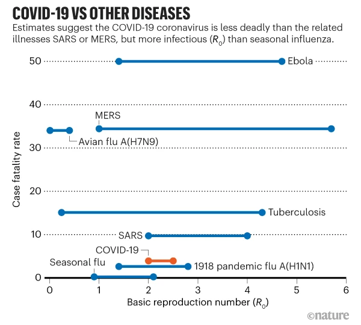
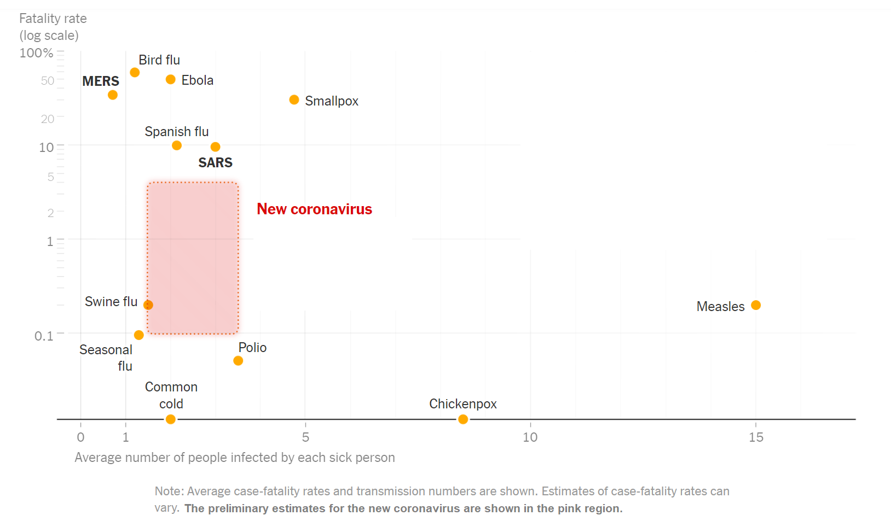

## week 1

### coalescent methods

Basic idea: build a phylogenetic (gene) tree based on (ideally) neutral genomic samples. The **shape** of the tree (rate of branching per unit time) tells us whether the population is decreasing, increasing, or stable.

- times with small population size have more branching
- times with large population size have less branching

See @elliotIntroduction (intro, a little mathy, but very clear); @kuhnerCoalescent2009a (intro journal article); @volz_phylodynamics_2009 (using coalescents for epidemics); @stadlerBirth2013 (ditto)

## malaria map

See the Malaria Atlas Project at https://malariaatlas.org/; also @hayMalaria2006

#  week 2

## $R_0$ and case fatality rate

There are lots of these graphs/comparisons.  Here's one from @callawaycoronavirus2020:

I'm a little surprised by the width of the MERS $R_0$ estimate. 

Here's another one from the New York Times [@thelearningnetworkWhat2020]:

# references
