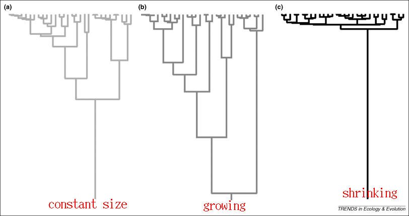

### coalescent methods

Basic idea: build a phylogenetic (gene) tree based on (ideally) neutral genomic samples. The **shape** of the tree (rate of branching per unit time) tells us whether the population is decreasing, increasing, or stable.

**Fisher-Wright model**

* in a *constant* population, every parent (allele) has exactly one offspring **on average** in the next generation
* we can calculate the probability that *two* alleles came from the same parent, which would represent a branching event

- times with small population size have more branching
- times with large population size have less branching

See @elliotIntroduction (intro, a little mathy, but very clear); @kuhnerCoalescent2009a (intro journal article); @volz_phylodynamics_2009 (using coalescents for epidemics); @stadlerBirth2013 (ditto)

**skyline plots** show the estimated population size over time

# references
