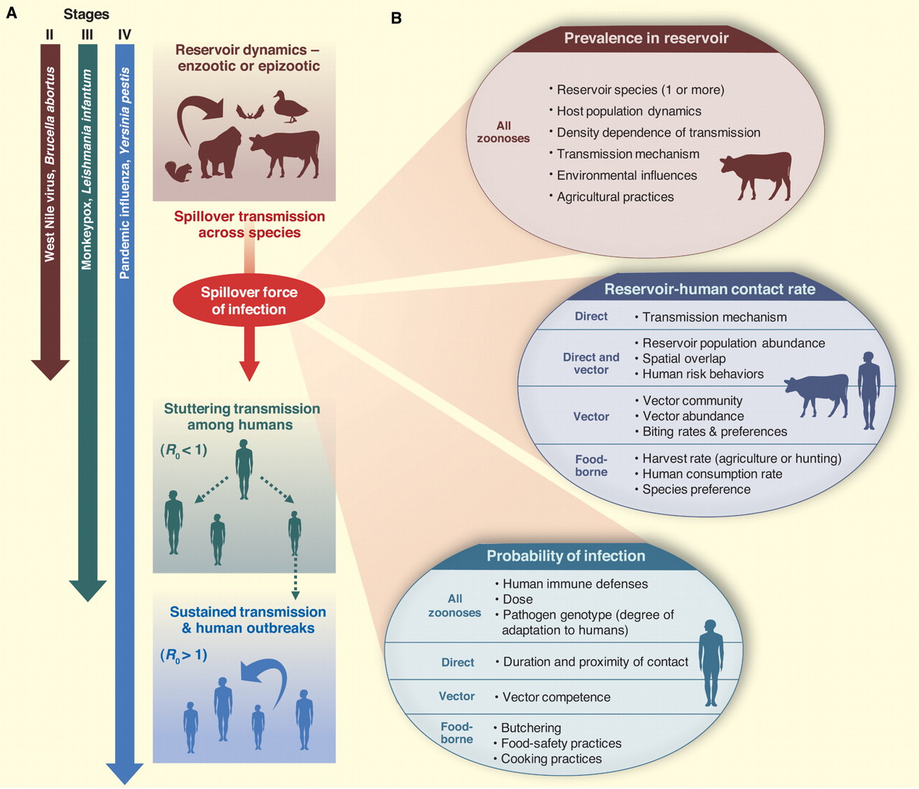
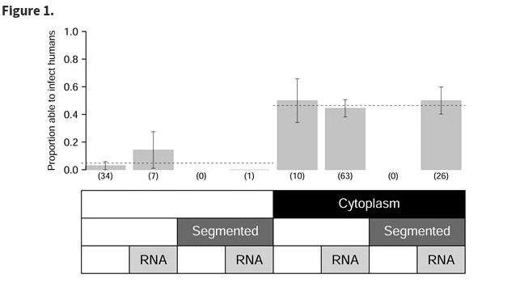
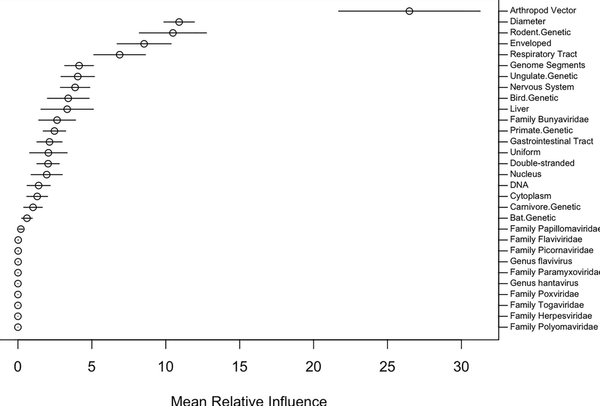
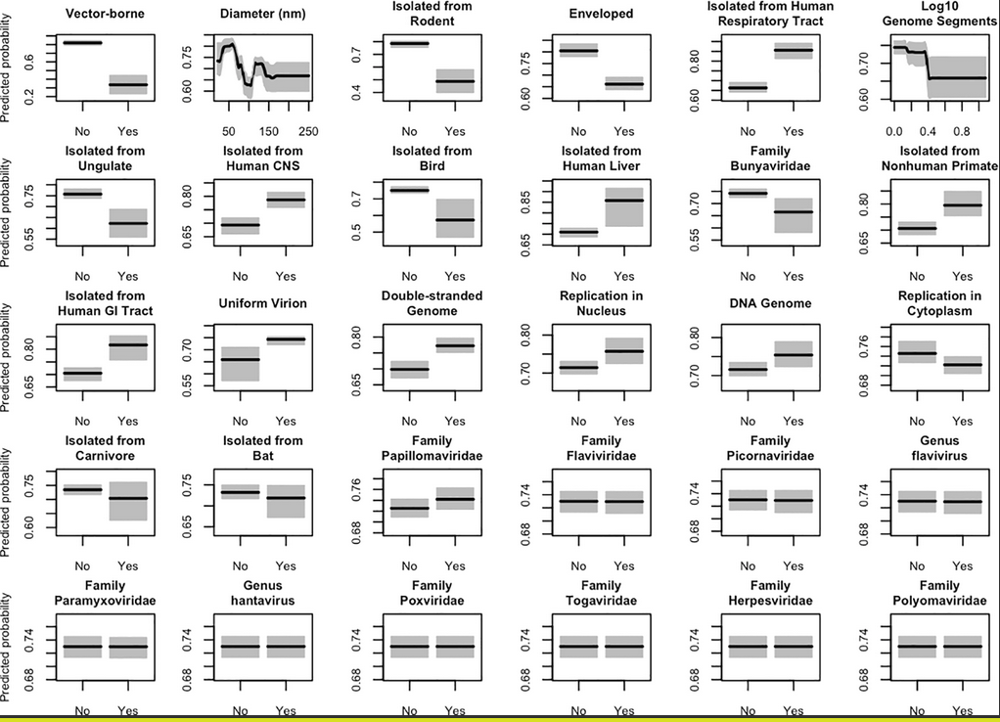
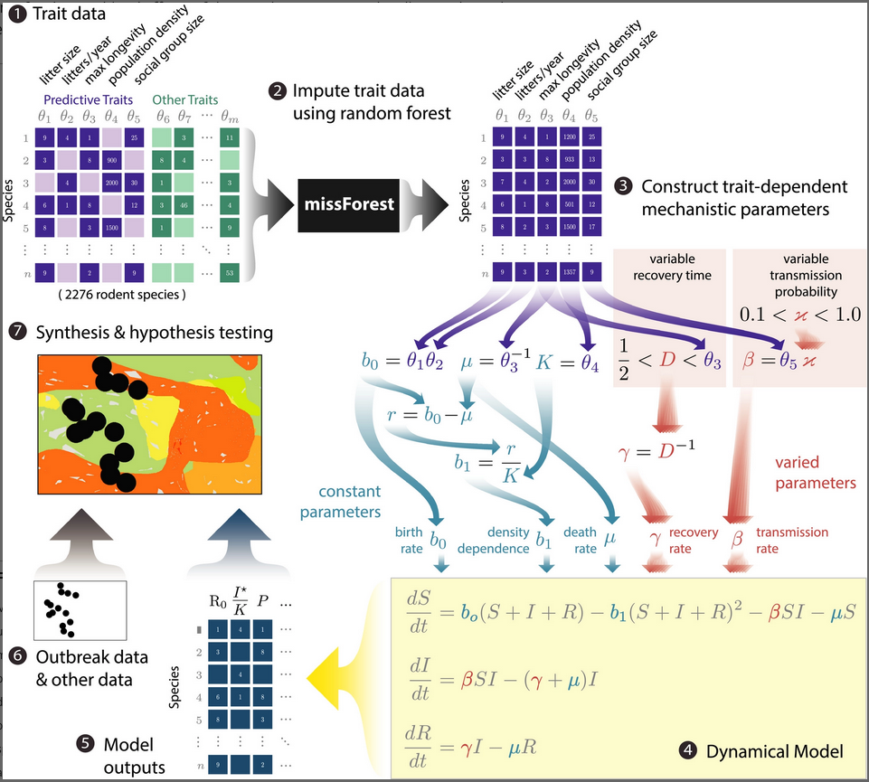
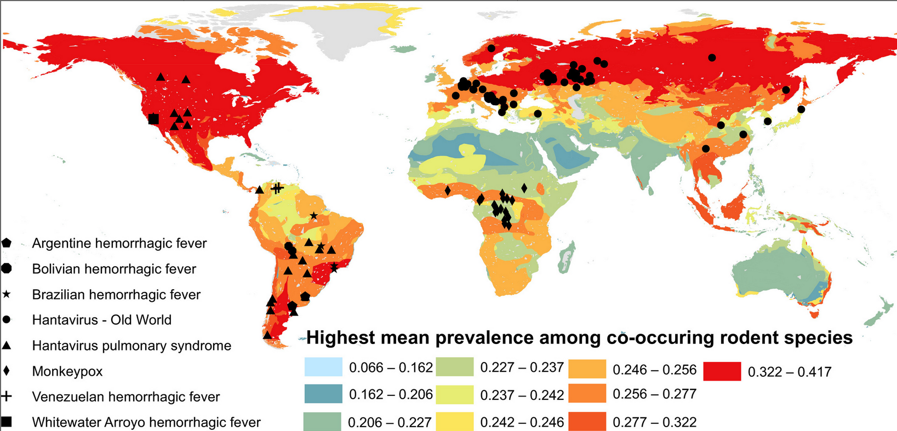

```{r setup, include = FALSE}
library(knitr)
opts_chunk$set(echo=FALSE, fig.width=6, fig.height =4)
```

## emerging and re-emerging disease



basically, anything we're worried about

- encounter filter: changing patterns of reservoir host/vector distribution, human contact, ...
- compatibility filter: changes via mutation, recombination, selection for resistance, ...

Do we need to understand *everything*?

- reservoir ecology
- pathogen biology
- human-reservoir interactions

How do we understand? How do we predict?

## *Batrachochytrium dendrobatidis*

- fungal pathogen 
   - most other chytrids are saprophytes, plant pathogens
   - *B. salamandrivorans*: salamander pathogen (more restricted)
- first discoved in poison dart frogs
- caused die-offs in E Australia, Central America, Colorado, California ...
- association with high altitude?

Very confusing ...

* declines occurred in pristine areas (probably not anthropogenic?)
* some species decline in the absence of Bd
* some species stable in the presence of Bd  
(Bd may have been there all along?)

- **tipping point hypothesis**: in populations all the time, but something happened to increase virulence/reduce tolerance or resistance ($\approx$ compatibility filter)
   - climate change/El Niño ? 
   - ultraviolet radiation?
   - pesticides?
   - combination (species × temperature × U/V × pesticide × ...)?
[@pounds_widespread_2006; @rohr_evaluating_2008; @rohr_linking_2010]

- **novel pathogen hypothesis**: mutation/speciation + dispersal

- detection in historical specimens: CA/bullfrog, Brazil ...
- genomics (challenging!)
- Asian sampling

@fisher_chytrid_2020

## effects of climate change

- warming 
    - 'good' or 'bad' for pathogens?
    - vector biology
    	- extended range
		- higher activity?
- changes in seasonality, hydrological cycles
- local landscape change
    - hydrology
	- land cover (Lyme disease)
	- forest cover
- changes in reservoir communities

## effects of biodiversity change: dilution effect [@keesing_dilution_2021]

   - does increased biodiversity decrease disease?
   - variation in reservoir competence
   - high-quality hosts decrease with increasing biodiversity
       - encounter reduction; host regulation; vector preferences

@kain_predicting_2019

@rohr_towards_2020

	   
   
## prediction

@pulliam_ability_2009



@walker_transmissibility_2018






@han_integrating_2020





@carlsonPlague2021

@evansExposure2023

@macdonaldAmazon2019a

##  References
 
::: {#refs}
:::

---

Last updated: `r Sys.time()`
	


