```{r setup, include = FALSE}
library(knitr)
opts_chunk$set(echo=FALSE, fig.width=6, fig.height =4)
```

## emerging and re-emerging disease

Basically, anything we're worried about

* **emerging**: new to  a host: most often (in humans) via *zoonotic spillover*, but could be an existing disease that is expanding its range/becoming more infectious, virulent, whatever
* *re-emerging*: a parasite that was previously thought to be controlled, but is of renewed concern. Due to socioeconomic change, landscape change, climate change, evolution of antibiotic/antiviral resistance, etc.) 

* **encounter filter**: changing patterns of reservoir host/vector distribution (due to climate/landscape change), human contact, ...
* **compatibility filter**: changes via mutation, recombination, selection for resistance, ...

* **disease triangle** (from plant pathology): need co-occurring host, pathogen, environment (for transmission: also consider virulence, treatment resistance ...)

* Local change > global change
* Parasites may get better, or worse, or different due to changes ...

## Malaria in North America

* established by immigration of enslaved people from west Africa
* landscape change (agricultural clearance/hydrological changes)
* well established by 1850s except in northern/high-altitude/arid places
* poorly diagnosed, haphazardly treated
* decline due to drainage 1900-1920
* 5000 deaths/year (1930s) -> <10 (1950s)
* improvements in nutrition, medical care, housing, insecticides

>  We now know that anopheline mosquito breeding throughout the country was sufficiently low so that it was difficult for overseas malaria to become established inside the country, and that the prognostication of a wide spread development of overseas malaria in the American anophelines was based on a failure to consider the very great reduction in mosquito breeding which had occurred since 1931.

@fausthistory1951

$R_0$ for vector borne diseases = ($R_0$ vector-to-host $\times$ $R_0$ host-to-vector): proportional to mosquito-to-human ratio (but preventing bites reduces both components)

## Malaria changes

Often driven by **local** landscape change:

* Combinations of hydrological cycle, temperature, predators: e.g. brick-making pits in western Kenya [@carlsonField2004]
* @macdonaldAmazon2019a: deforestation increases malaria, but malaria decreases deforestation (statistical model, we don't know the mechanism: ecological change, increased human-vector contact?)

## Mosquito-borne diseases in 'temperate' countries 

* 'autochthonous'/'local transmission events'
* doesn't mean $R_0 > 1$, but does mean $R_0 > 0$ ...
* local transmission of:
    * chikungunya (*Aedes albopictus*, *A. aegypti*: Europe, North America) [New York state, 2025] [@cdcChikungunya2025; @NYchikungunya2025] 
    * Zika (Florida, Texas) (*Aedes*)
    * dengue (Argentina, California, Florida, Texas [@centersfordiseasecontrolCurrent2025; @barrenecheaCharacterization2025]) (*Aedes*)
    * malaria [@devitaPublic2025] (*Anopheles* mosquito spp)

## *Candida auris*

* @casadevallEmergence2019a; @casadevallEnvironmental2021; @degaetanoCandida2024
* newly emerging fungal pathogen (first isolated 2009)
* not found in fungal collections before 1996
* molecular clocks: disease-causing clades MRCA ~ 37 years ago
* multidrug resistant
* heat-tolerant (up to 42°, more than nearest relatives - fever-tolerant?)
* newly virulent? newly resistant? newly heat-tolerant?

## *Batrachochytrium dendrobatidis*

- fungal pathogen 
   - most other chytrids are saprophytes, plant pathogens
   - *B. salamandrivorans*: salamander pathogen (more restricted)
- first discoved in poison dart frogs
- caused die-offs in E Australia, Central America, Colorado, California ...
- association with high altitude?

Very confusing ...

- declines occurred in pristine areas (probably not anthropogenic?)
- some species decline in the absence of Bd
- some species stable in the presence of Bd

- **tipping point hypothesis**: in populations all the time, but something happened to increase virulence/reduce tolerance or resistance ($\approx$ compatibility filter)
   - climate change/El Niño ? 
   - ultraviolet radiation?
   - pesticides?
   - combination (species × temperature × U/V × pesticide × ...)?
[@pounds_widespread_2006; @rohr_evaluating_2008; @rohr_linking_2010]
- **novel pathogen hypothesis**: mutation/speciation + dispersal
   - detection in historical specimens: CA/bullfrog, Brazil ...
   - genomics (challenging!)
   - Asian sampling

@fisher_chytrid_2020

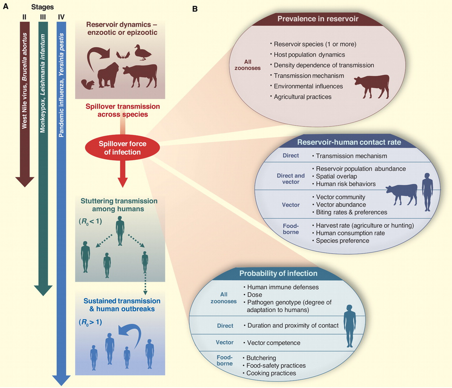

## theory

Do we need to understand *everything*?

- reservoir ecology
- pathogen biology
- human-reservoir interactions

How do we understand? How do we predict?

## effects of climate change

- warming 
    - 'good' or 'bad' for pathogens?
    - vector biology
    	- extended range
		- higher activity?
        - lots of debate [@omumboRaised2011]
		- details of temperature sensitivity: e.g. @mordecaiOptimal2013b; @ryanMapping2015; @mordecaiClimate2020: shift from *Anopheles gambiae* to *Aedes aegypti*, malaria to arboviruses (dengue, chikungunya etc.); 
- changes in seasonality, hydrological cycles
- local landscape change
    - hydrology
	- suburbanization and reforestation: Lyme disease
	- deforestation [@macdonaldAmazon2019a]
- changes in reservoir communities

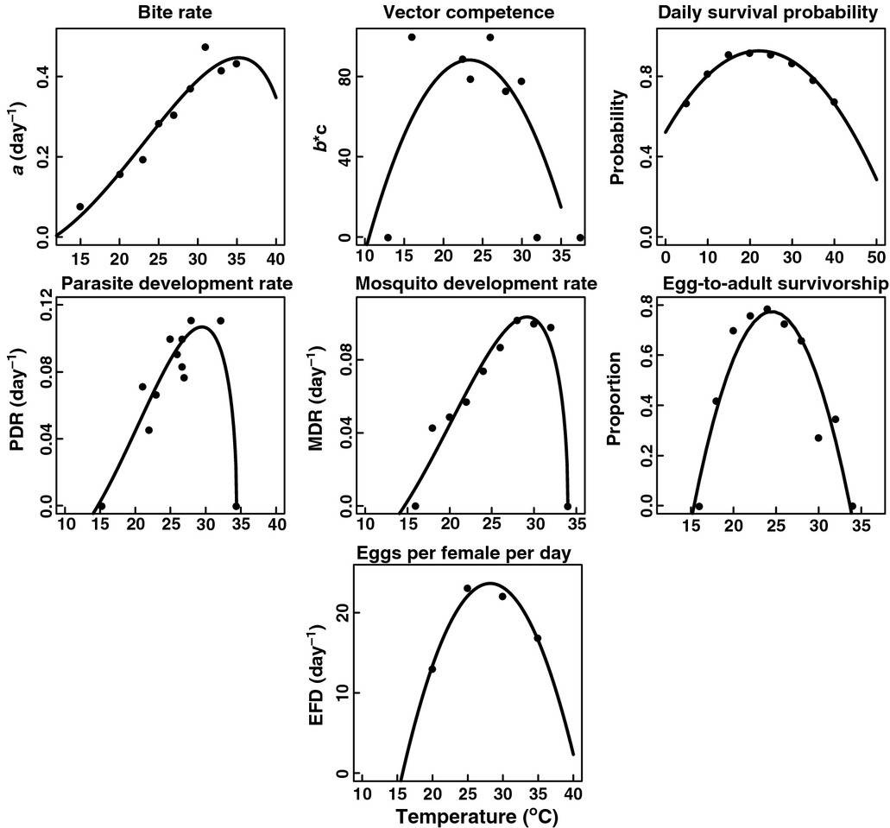

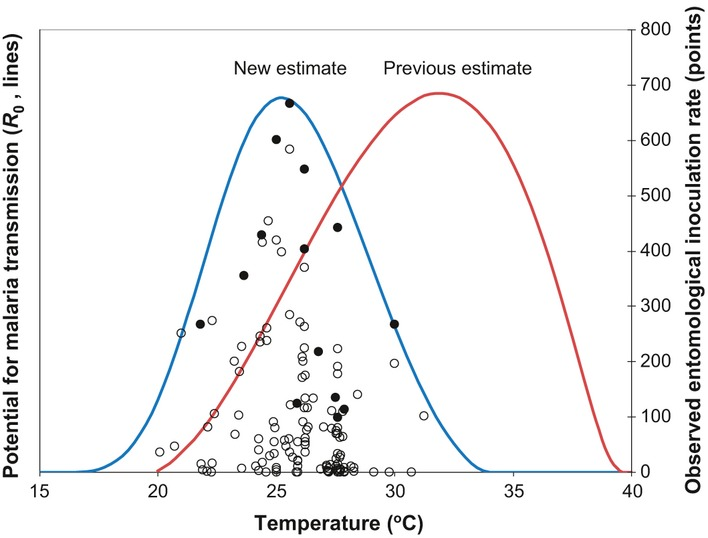

## effects of biodiversity change: dilution effect [@keesing_dilution_2021]

- does increased biodiversity decrease disease?
- variation in reservoir competence
- high-quality hosts decrease with increasing biodiversity
    - encounter reduction; host regulation; vector preferences
- depends on how the community is changing
    - what is driving biodiversity loss?
    - what species are more likely to be lost?
    - are less/more **competent** host species more likely to be lost?

@kain_predicting_2019: 

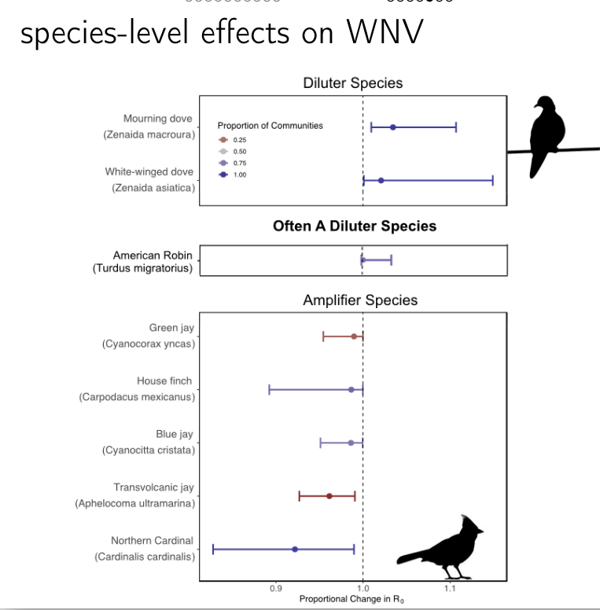

@rohr_towards_2020: meta-analysis (again ...)

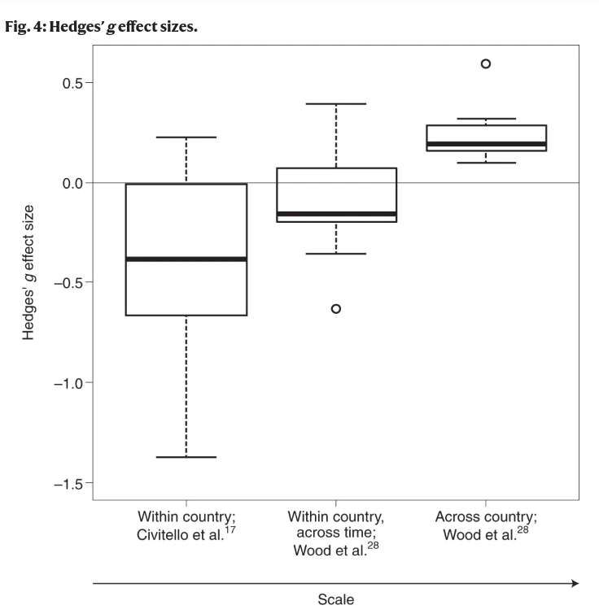	   

- @carlsonPlague2022: *higher* rodent diversity and climate anomalies drive plague spillover

## surveillance and prediction

* which viruses will emerge, where, why?

---

@pulliam_ability_2009: predict zoonotic transmission of livestock viruses

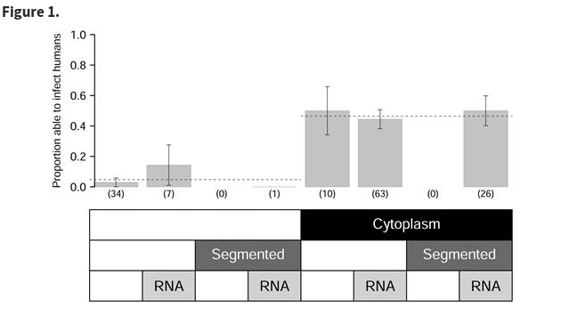

---

@walker_transmissibility_2018: predict human transmission ability of zoonotic viruses

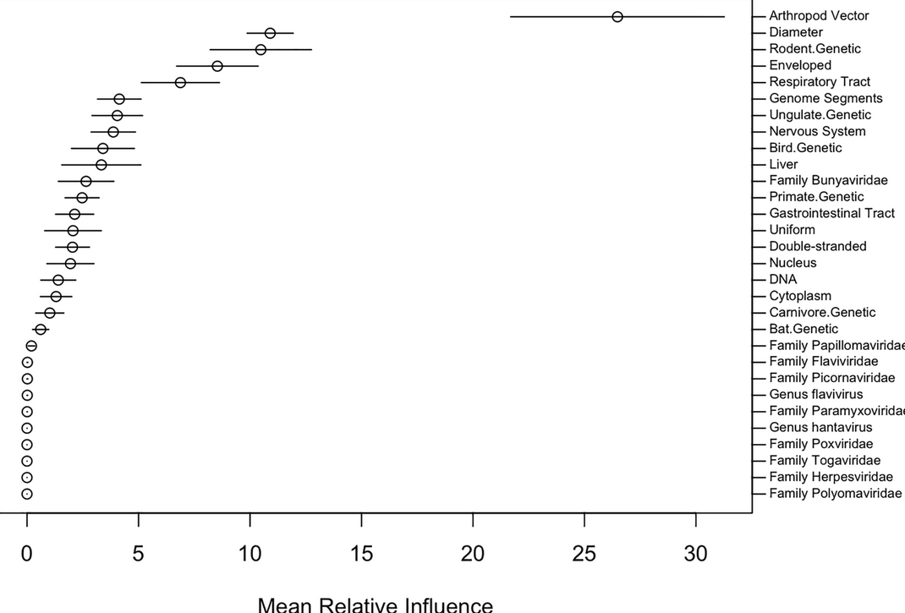

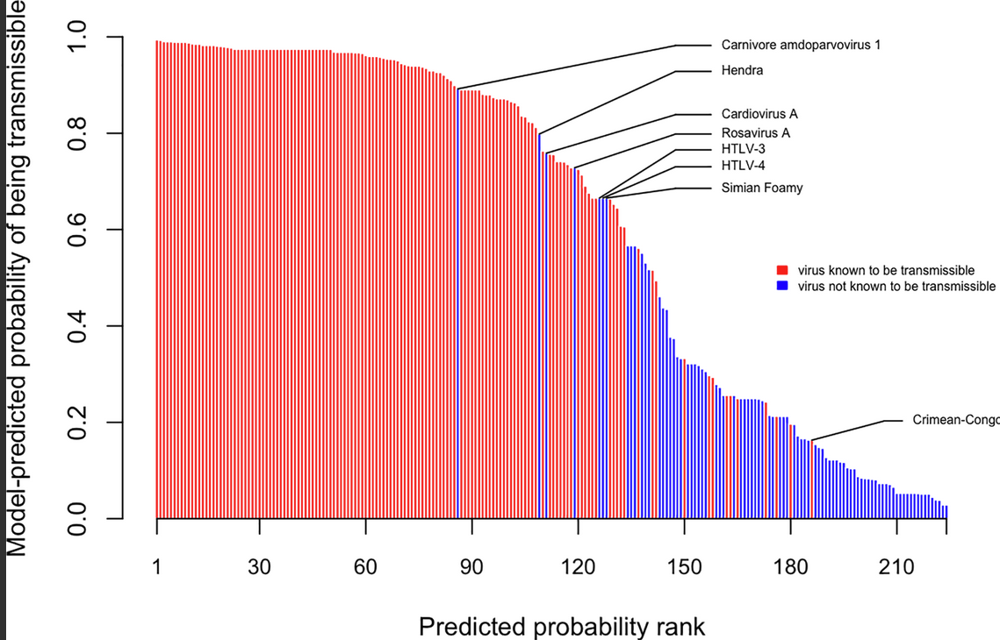

<!-- 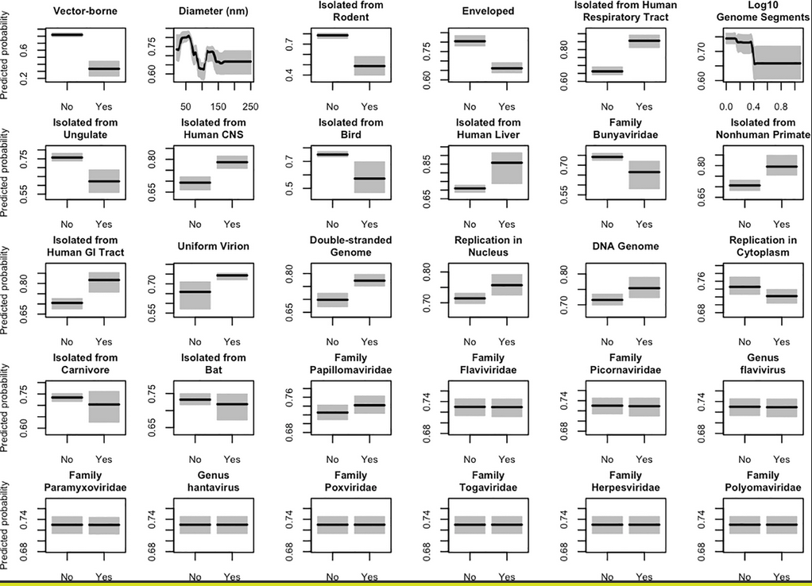 -->

@evansExposure2023: 2017-2020 sample: 12% of 693 individuals sampled in Myanmar were seropositive for sarbecovirus, more likely if they were loggers/hunters or had been exposed to bats ...

@han_integrating_2020: model rodent life history

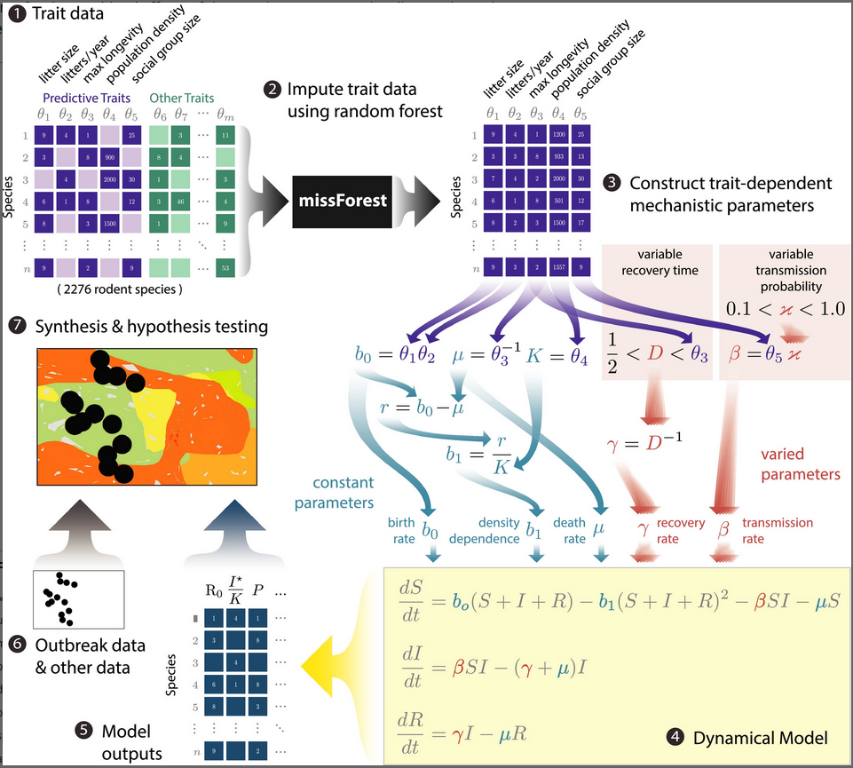

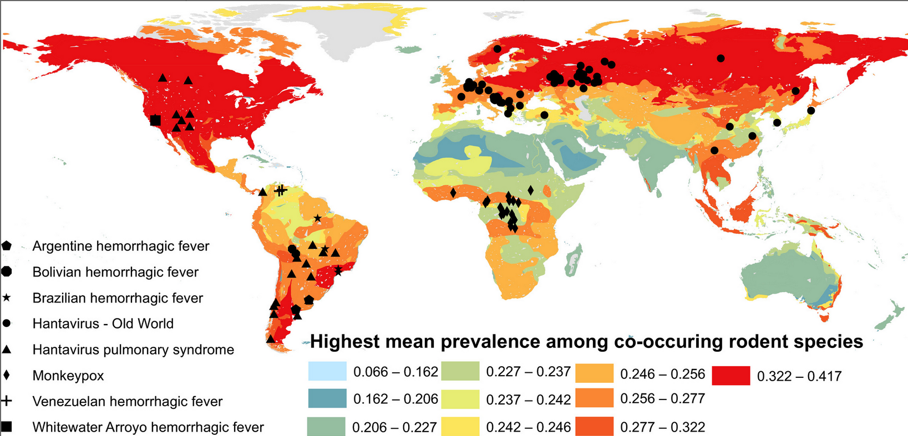


##  References
 
::: {#refs}
:::

---

Last updated: `r Sys.time()`
