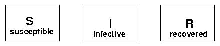
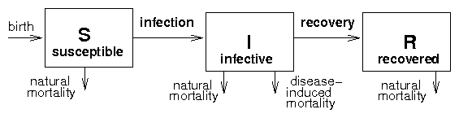
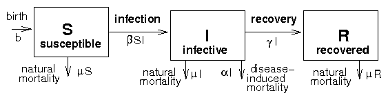
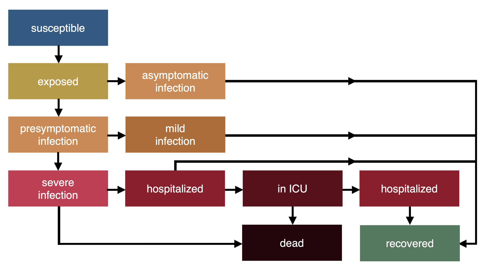
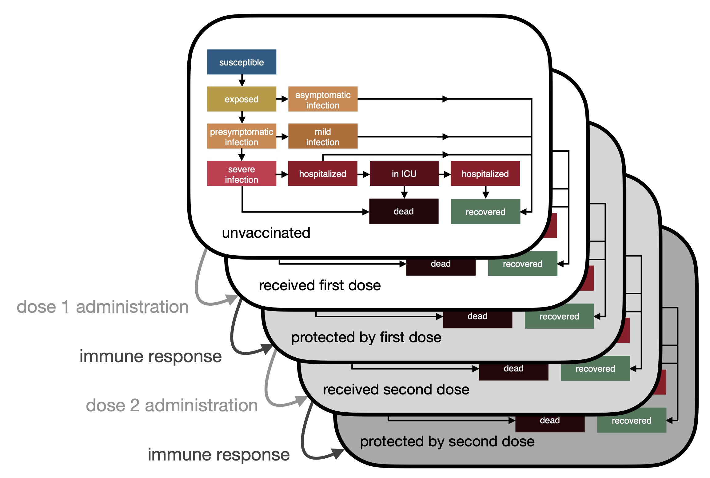
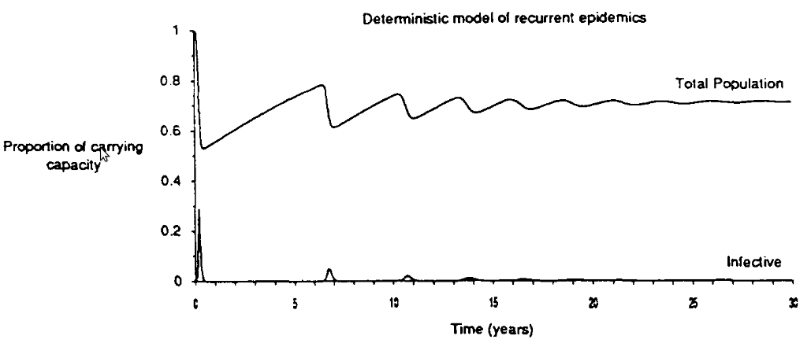

## Basics

Group individuals into categories; figure out the
rates at which various events (infection, recovery, death, etc.) occur,
and how they move individuals between categories/change the population
sizes; write down equations based on these rates. "All models are wrong but some are useful"
(Tukey), but they can help us figure out the rate of spread, or the
equilibrium prevalence.

Some distinctions: micro- or macroparasite? Include *vital dynamics*
(birth/death)? Life cycle (direct, vector, complex)? Virulence/effects
on host? Genetics? Heterogeneity?

## Compartmental ("box") models

Box models divide the host population up into boxes according to
epidemiological status, e.g. **S**usceptible, **I**nfective, **R**emoved
(**SIR** models). Could also include e.g. **E**xposed (**SEIR** model).

Depending on the host-parasite biology of a particular disease (is there
an incubation period? do any hosts recover, and if so do they acquire
immunity or do they become susceptible again?), we can write down a box
model, for example:

{height="1in"}

Alphabet soup: SI (e.g. tuberculosis), SIS (e.g. gonorrhea), S(E)IR
(e.g. measles), SIRV (vaccine), etc..

Now consider the transitions (**vital dynamics**: {birth, natural mortality}, disease-induced
mortality, infection, recovery, vaccination).

{height="1in"}

Finally, quantify the *transition rates* (e.g. constant birth rates
($b$), constant *per capita* recovery etc., **mass-action** transmission
($\beta S I$)).

We end up with the following model:

{height="1in"}

Write down balance equations: incoming - outgoing. 

<!-- https://bookdown.org/yihui/rmarkdown-cookbook/raw-latex.html -->

<!-- FIXME: get \vphantom working?? -->

```{=latex}
\begin{equation}
\begin{split}
	S' & =  \underbrace{b}_{\text{birth}}
	- \underbrace{\beta S I }_{\text{infection}}
   - \underbrace{\mu S }_{\text{nat. mort.}}  \\
   I' & =  \underbrace{\beta S I }_{\text{infection}}
   - \underbrace{\mu I }_{\text{nat. mort.}} 
   - \underbrace{\alpha I }_{\text{dis. mort.}}
   - \underbrace{\gamma I }_{\text{recovery}} \\
   R' & = \underbrace{\gamma I }_{\text{recovery}}
   - \underbrace{\mu R}_{\text{nat. mort.}} \\
	 \end{split}
\end{equation}
```

How do we deal with these equations? We can do algebra, or simulate.

Build up basic dynamics: SI, SIR, SIR with vital dynamics.

-   Beginning of epidemic: *exponential* growth (assuming well-mixed
    population, etc.)
-   Simple (SI) epidemic: *logistic* growth
-   SIR without vital dynamics: epidemic grows, then collapses
-   SIS, SIR with vital dynamics: equilibrium (maybe)
-   latent/exposed classes: SEIR
-   seasonal variation, other feedbacks: epidemic cycles
-   COVID: asymptomatic, presymptomatic, mild/severe, hospital, ICU ...

{height="4in"}

{height="4in"}

(pictures: Irena Papst)

@hethcote_thousand_1994

**In groups: try to come up with a compartmental model for malaria!**

# Conclusions from basic epidemic models

## Basics

- $R_0$
    - per-generation fitness
	- disease establishes if $R_0>1$
	- depends on host, parasite, environment ...
	- $r$ (growth rate) or *doubling time* also useful
    - critical control fraction is $v^* = 1 - 1/R_0$

```{r critical-control, echo=FALSE, fig.cap = "critical control fraction", fig.width = 6, fig.height=4}
par(las=1, bty="l",yaxs="i")
curve(1-1/x,from=1,to=10,xlab=expression(R[0]),ylab="Critical control fraction", axes=FALSE,
      ylim=c(0,1))
axis(side=2)
abline(h=1,lty=2)
abline(v=1,lty=2)
axis(side=1, at=c(1, 2, 4, 6, 8, 10))
box()
```	

- models without vital dynamics
   - parasite dies out before it infects all hosts
   - **final size** depends only on $R_0$ (in simple cases)
   
```{r final-size, echo=FALSE, fig.cap = "final size of SIR model", fig.width = 6, fig.height=4}
library(emdbook)
finalsize <- function(R0) {
  1+1/R0*lambertW(-R0*exp(-R0))
}
par(las=1, bty="l",yaxs="i")
curve(finalsize,from=1,to=10,xlab=expression(R[0]),ylab="Final size", axes=FALSE)
axis(side=2)
abline(h=1,lty=2)
abline(v=1,lty=2)
axis(side=1, at=c(1, 2, 4, 6, 8, 10))
box()
```

- models with vital dynamics
   - equilibrium when $S^*/N = 1/R_0$


## Variants on basic epidemic models

-   Macroparasite models: have to build in a way to track average
    parasite burden, variability in parasite burden, and processes like
    intensity-dependent mortality. May also have more complex life
    cycles (multiple hosts, free-living stages, etc.).

-   Transmission modes: e.g. vector-borne, sexually transmitted diseases
    (**STD**s). STDs have **frequency-dependent** transmission,
    $\beta S (I/N)$ instead of $\beta S I$, which means there is no
    population density threshold --- disease can persist in small
    populations, drive populations extinct. [@antonovics_generalized_1995]

-   Mixing models (STDs, age-structured, geographic, ...) --- who
    infects whom?

-   Demography: how does disease affect population growth? Malthus;
    HIV/AIDS. Depends on what ages are affected, who dies, effects on
    fecundity, behavioral responses.

-   Ecology: how many species are in the model? Predator/prey dynamics?

# Estimating $R_0$

## Estimating all model parameters


In principle, all of the parameters of the model (b, $\mu$, $\alpha$,
$\beta$) can be estimated from lab or field studies. The host
demographic parameters ($b$, $\mu$) are basic host ecology. Virulence
($\alpha$) can be determined from experimental infections or from
observational studies in the field, although both methods have their
problems. Virulence might be lower in experimental infections because of
differences in nutrition or environmental conditions in the lab.

Estimating $\beta$ is hard. Exceptions are vector-borne diseases like
malaria (estimate (1) biting rates, (2) probability of a mosquito being
infected when it takes a blood meal from an infected host, (3)
probability of a host being infected when it is bitten by an infected
mosquito) and HIV/AIDS (estimate sexual contact rates, partner change
rates, and probability of infection per partnership).

## Observing epidemic curves

During the initial phase of the epidemic, the number of infected
individuals should increase by a factor of $R_0$ for every parasite
generation. For example, if $R_0$ = 3 and the generation time is one
week then the numbers of infected individuals starting from a single
infected would be 1, 3, 9, 27, ...

Examples: AIDS, bubonic plague, foot and mouth disease in feral pigs,
phocine distemper virus, smallpox, SARS.

## Exposure surveys

If you know the fraction susceptible (i.e. those who have never had the
disease, $N-I-R$), you can use $R_0=N/S^*$. You can also use the
*age-exposure curve* of a population-the cumulation fraction of
individuals that have been infected (and possibly recovered) by a given
age to estimate $R_0$, using $R_0
\approx L/A$ (e.g. if host lifespan is 10 years and the average at which
individuals are infected is 2 years, $R_0 \approx 5$). In human
populations we can sometimes get age-exposure curves by following
cohorts or sending out questionnaires, but *serological* studies are
more powerful (work for any vertebrates, if we have the antibodies).

Examples: many human diseases, brucellosis in bison.

# More on long-term dynamics

-   SIR epidemic with birth; initial epidemic outbreak, followed by a
"trough", followed by population recovery. **Damped** or
**sustained** oscillations depend on details.

    {width="4in"}

- Simplest expectation is that epidemics will eventually settle down
to a stable equilibrium ("endemic") state

-   Size of fluctuations/damping rate depends on ratio of two scales:
    disease generation time (rate at which epidemic spreads) and
    population generation time (rate at which population turns over/new
    susceptibles appear)

## Stochastic extinction thresholds

-   constraint on $R_0$ is a *deterministic* threshold: assumes large
    (infinite) population size
-   what if population is finite? Chance of *stochastic fade-out* ---
    disease goes extinct locally by chance ($<1$ infective)
-   *Critical community size* --- depends on epidemic parameters, but
    hard to figure out. Approx. 250,000 for measles (based on data on
    islands/cities in US and UK) [especially large]. Probably not even
    relevant for diseases with latent stages, asymptomatic forms, etc..
    Perhaps important for staged eradication of disease. (Persistence
    threshold: suggests some more virulent/acute diseases may have
    emerged since human populations have become big enough to support
    them? Hard to understand early persistence of childhood diseases
    ...)

## Recurrent epidemics

What explains recurrent epidemics (or **epidemic waves**)?

- Slow damping (e.g. measles, phocine distemper virus)
- **Demographic stochasticity** (e.g. whooping cough)
- Strain shifts --- e.g. rhinovirus, influenza (SARS-COV-2!)
- Seasonality --- esp. schools (e.g. measles, lots of others)
- Behaviour (SARS-COV-2!, influenza [@he_inferring_2013])

Details of recurrent epidemics can range from really simple (similar
seasonal epidemics every year) to complex (chaos) [@olsen_chaos_1990]

## Longer-term epidemic shifts

Dynamics of epidemics can change over longer (decadal/century-long) Once again, can come from a variety of mechanisms:

- evolution/emergence --- e.g. *antigenic shifts* in influenza
- changes in ecological setting/epidemic parameters (demography, culture, climate change?) [@earn_simple_2000; @earn_acceleration_2020]

## Dynamics pictures

```{r sir-dynam, echo = FALSE, message=FALSE, fig.cap = "basic SIR dynamics", warning = FALSE, fig.width = 8, fig.height = 4}
source("sir_dynamics.R")
tmpplot(d1)
```

## Persistence (of hosts and parasites)

- When do hosts persist vs going extinct?
- When do pathogens persist vs going extinct?
- How do population dynamics interact with disease dynamics?
- Simple vs density-dependent host growth
- @briggs_enzootic_2010
- @tanner_critical_2019


##  References
 
::: {#refs}
:::

---

Last updated: `r Sys.time()`
