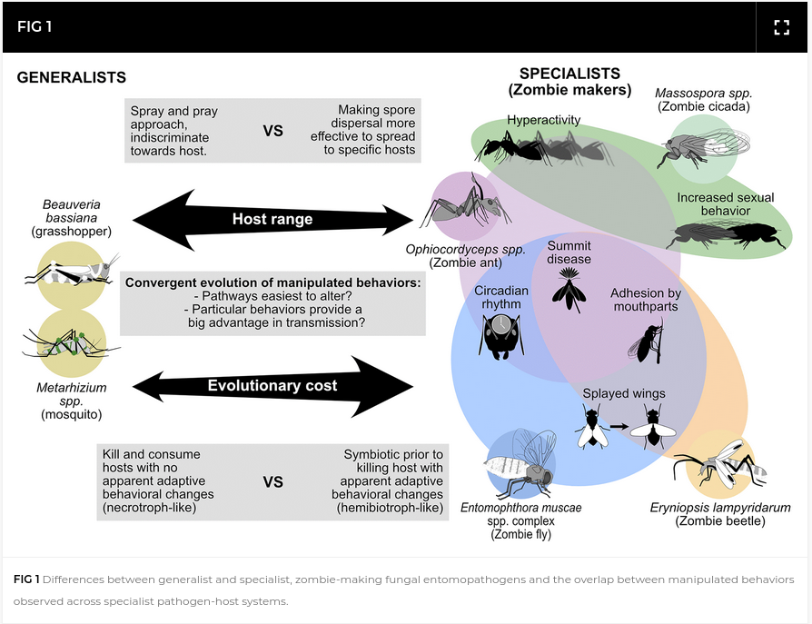
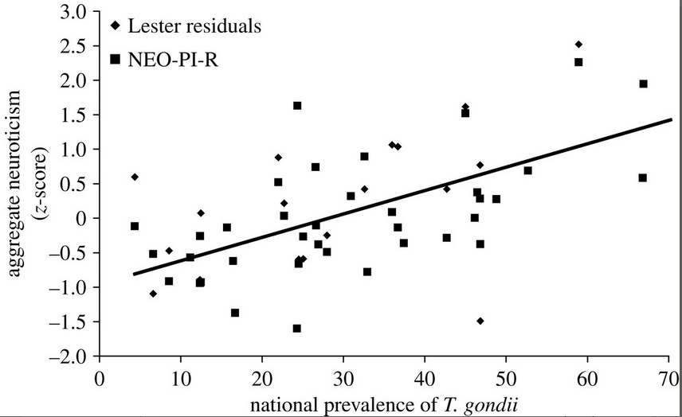
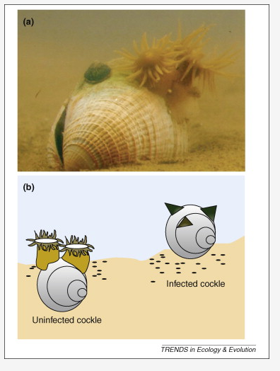
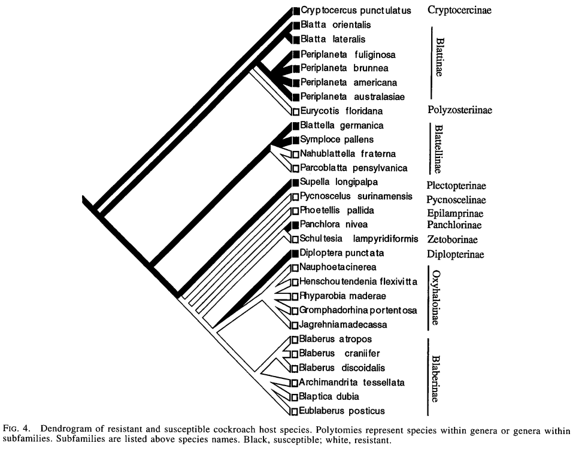

```{r setup, include = FALSE}
library(knitr)
opts_chunk$set(echo=FALSE, fig.width=6, fig.height =4)
```

A common conclusion about parasite life history is that parasites must
have high fecundity in order to ensure their transmission from one host
to another. However, there is another alternative -- improving the
probability of transmission for each offspring by investing resources in
quality, rather than quantity. How can a parasite do this?

## Encouraging transmission: upstream/downstream

Combes: where does the stimulus/signal for transmission come from
(e.g., downstream host or downstream host's environment)? Which host is
manipulated (**upstream** or **downstream**)?

Free-living infective stages can't necessarily manipulate hosts, but
parasite larvae can home in on the host's environment (e.g. ticks
crawling to the top of a grass stalk) or on the host itself (e.g. by
detecting chemical signals given off by the host).

For non-free-living infective stages (particularly in the case of
trophic transmission), parasites can try to manipulate either the
upstream or the downstream host's behavior. However, they only have
access to their own physiology and to the physiology of the upstream
host (which they are currently inhabiting); if they want to manipulate
the downstream host, they have to present it with a **signal**. If a
trematode makes a killifish behave strangely, thus increasing its chance
of parasitism by a bird, who is being manipulated? The killifish or the
bird?

## Examples

**Dicrocoelium dendriticum**

- gut fluke
- life cycle: mammal $\to$ snail $\to$ ants
- ruminants (mostly cows) are the **definitive host**, but humans are also infected
- modifies ant behavior so that they crawl up grass stalks to improve their chances of being ingested "accidentally" by a cow and thus transmitting the parasite. The upstream host (ant) is having its physiology and behavior modified to bring it into the environment of the downstream host (cow), which behaves normally. The "signal" that ants respond to is gravity (ants move up stalks).
   - "a phylogenetically old sleeping behaviour typical for some  non-social Hymenoptera (e. g. Ammophila)" [@wickler_evolution-oriented_1976]
   - *kin selection* operating: the cercaria that modifies behaviour isn't transmitted ... (cf. slime mold, *Dictyostelium*)

**Fungal entomopathogens**

- *Ophiocordyceps* is the poster child
- @debekkerOphiocordyceps2019a, @debekkerMechanisms2021, @debekkerBehavior2014, @araujoZombieAnt2019 ([link](https://ars.els-cdn.com/content/image/1-s2.0-S0960982219311649-gr1_lrg.jpg))



**Toxoplasma gondii**

- intracellular parasite of neurons
- in rats, attraction to feline urine (only!) and hyper-aggression [@house_predator_2011;@vyas_behavioral_2007;@lamberton_specificity_2008]
- by sexual attraction? [@house_predator_2011]
- neuroimmunological mechanisms
- association with mental disorders in humans?? culture?? [@lafferty_can_2006;@burgdorf_large-scale_2019;@torrey_parasites_2022]
   
   

**Curtuteria australis**

- trematode parasites of bivalve molluscs 
- specific to 'feet': stunting [@thomas_manipulation_1998]
    - maybe cockles with small feet are more likely to be parasitized?
- reduces burrowing behaviour; *not* photophilia
- similar effects in closely related parasite/host species pairs
- **ecosystem engineer** [@lefevre_ecological_2009;@selbach_mussel_2020]



   
## Categories of behavioral change

- *Change in activity* (up or down): reduction in speed/distance
travelled/etc. or increased activity,
exploration etc. (rats with *Toxoplasmosis*, mice with
*Trichinella*): may increase predation
- Many examples of changes in fish behavior [@kuhn_remote_2015)]
- Acanthocephalans in invertebrates (good to test *difference* in
activity patterns among species rather than just increase/decrease,
which are more likely to be caused by pathology): amphipods, cockroaches
- Vectors can be affected: fly less (mosquitoes with filaria,
*Plasmodium* (malaria) fly less) or bite more, or change host preferences
- *Conspicuous behavior:* Height-seeking behavior (fish, ants). Side
effect of pathology (e.g. hypoxia in fish)? Photophilia
(light-seeking), heat-seeking behavior: *behavioral fever* (Hart,
1988; Boorstein and Ewald, 1987; McClain et al 1988). Changes in
color (loss of camouflage). Changes in size.
- *Changes in social behavior:* castration, changes in mating behavior
(host or parasite or compensation?), changes in dominance; do
parasites drive host social behavior (group size, etc.)?

# Mechanisms of host manipulation

What structures are affected by parasites? What are the proximal
mechanisms by which parasites change behavior?

-   Organ disruption or damage:
    -   Sensory organs (can increase or decrease transmission:
        *Onchocerca volulus*)
    -   Gonads (castrators)
    -   Central nervous system (CNS): rabies. Much CNS destruction is
        just nasty and not apparently adaptive: e.g. syphilis, prion
        disease, *Parelaphostrongylus tenuis* in moose. CNS pathologies,
        or ear pathologies, caused by trematodes may also be implicated
        in some dolphin strandings (they may interfere with
        echolocation).
    -   muscles: e.g. lemmings (*Dicrostonyx richardsoni*) increase
        exploratory activity, mice with *Trichinella pseudospiralis*
        travel farther. These could also be compensatory reactions to
        changes in nutrient status (see below).
-   Changes in nutritional or metabolic status: the host may increase
    activity to compensate for nutrient losses to parasites, or
    decreasing it because it is starving, or change metabolic rate to
    try to kill the parasite. Changes in nutritional status come from:
    -   damage to assimilation organs (e.g. gut destruction)
    -   anorexia (host response? more common in poorly fed animals)
    -   change in metabolic processes: e.g. malarial fever increases
        basal metabolic rates by 40% (this example is
        caused by host resistance, not by parasite manipulation)
    -   Interference with control systems (the coolest!) (esp
        neuroendocrine or growth factor) e.g. *Gammarus*,
        *Dicrocoelium*.

# But is it really manipulation?

Suppose a parasite species inhabits the CNS and changes host behavior.
Is the parasite in the CNS to avoid host defenses, with changes in
behavior being a coincidental result of tissue damage, or are they
actively changing host behavior?

To answer these questions we can quantify changes in
parasite and host fitness. In order to determine whether a change in
host physiology and/or behavior deserves to be called "manipulation", we
have to classify its effects on host and parasite fitness. Here is one
such possible classification:

  ---------------------- ------------------ -----------------------------------
   **Parasite fitness**   **Host fitness**  **Explanation**
    + (transmission)            -           Parasite manipulation
    + (survivorship)           0/-          Parasite site selection
    - (survivorship)            +           Host behavioral resistance
    - (transmission)            ?           Host inclusive-fitness reactions?
           0/-                  -           Host pathology?
           0/+                  +           Host compensation (tolerance)
  ---------------------- ------------------ -----------------------------------

# Testing hypotheses

## Testing behavioral changes

Host behavioral changes in the presence of parasites are well documented. However, ecological
(correlational) studies might get the direction of causality wrong: do
hosts change their behavior when they are infected, or does behaviour 
increase their chances of infection? The ideal
experiment would be to compare the transmission of parasites that do or
don't influence host behavior in a particular way. There are many
obstacles to this kind of experiment:

-   it's not usually possible to turn off host manipulation, although 
    maybe possible in cases where we know the detailed mechanisms of manipulation;
-   hard to set up a complete artificial
    environment to allow transmission in the lab, particularly for
    heteroxenous parasites;
-   transmission is sensitive to environment in a way that is
    hard to replicate in the lab (harder than measuring
    physiology of a single life stage in the lab).

Best-case scenario (?): study the transmission of
two closely related parasites, either in the lab or in the wild. (Also:
before-and-after studies, parasitized behaviors that are outside the
usual repertoire.)

Other possibilities:

-  field epidemiological or observational studies [@moore_responses_1983]; or the seal study
reported in Combes [@des_clers_modelling_1990], or the comparisons done by Lafferty and Morris
of predation on infected vs. uninfected fish) -- these kinds of
studies give you accurate information, but not detailed information,
about what's happening in natural systems

-   phylogenetically controlled studies (e.g. Moore and Gotelli 1996),
which measure behaviors in a range of related species to test
whether they represent adaptations or mere phylogenetic constraints.

## Testing effects on host and parasite fitness

A common assumption is that host behavior changes are driven by and for
parasites, to increase parasite survivorship and transmission. However,
their fitness consequences for the parasite or the host can be either
positive, neutral, or negative: these behavioral changes can constitute
adaptations by either the host or the parasite, or they can be
"coincidental" side-effects of the host-parasite relationship.

In many cases behavioral changes of hosts are side-effects of parasite
pathology, or host reactions, and do not necessarily enhance parasite
fitness.

-   check to make sure that the observed reaction is actually most
    consistent with a transmission-increasing adaptation. For example,
-   increased predation rates of parasitized hosts (assumed to be an
    adaptation for transmission to the next host) is not necessarily by
    the right host [@brassard_parasite-induced_1982].
-   Parasites may select particular host organs (that have strong
    effects on host behavior) for reasons other than influencing host
    behavior. For example, parasites in host CNS tissues, or in the lens
	of the eye, are often
    isolated from host defenses: 'immunological privilege' [@dunsmore_accumulation_1983; @szidat_structure_1969].
-   if a change in a control system is a parasite adaptation, then any
    changes in behavior should be postponed until the parasite is
    actually *in an infective stage*, ready to infect the next host in the
    life cycle.
-   Mechanistic explanations, really nailing down the biochemical or
    other changes leading to behavioral change, are also powerful. For
    example, parasitized *Gammarus* have modified escape responses.
    Injecting *Gammarus* with serotonin produces similar results;
    octopamine can block the results [@helluy_serotonin_1990;@perrot-minnot_multidimensionality_2014] Similarly, *S. mansoni* leads to
    higher opioid levels in hamsters, although this could be either a host response or a parasite manipulation [@kavaliers_opioid_1988]. In some cases
    (growth hormone in rodents), parasites actually directly produce
    proteins that act like host hormones [@phares_unusual_1996], which makes it pretty clear that it is a case of parasite manipulation.


# Comparative/phylogenetic analysis

Not much exists, people have been too busy looking at the amazingly cool
detailed mechanisms of manipulation of host behavior by parasites.

Some of the difficulties with doing comparative analysis are (1) the
lack of good phylogenies of parasites (which has come up before) and (2)
the lack of standardized measures of behavioral change; in the case of
life history or virulence, at least there are more standard benchmarks
(longevity, size, fecundity, etc.) for people to measure.

@moore_evolutionary_1996



Acanthocephalans are transmitted from cockroaches to other hosts by
predation, which makes them a good candidate for (parasite-) adaptive
parasite-induced behavioral change driven by predation success. Moore
and Gotelli took a morphological study of cockroaches, constructed a
cockroach phylogeny, and mapped their own studies of a variety of
different behavioral responses (substrate choice, etc.) onto the
phylogeny. They found that at the family level there was little
*phylogenetic inertia*, although there was some at the subfamily level;
overall conclusion, behavioral responses to parasitism
evolve fairly rapidly relative to the time scale of speciation and
higher-taxon divergence.

# Costs of manipulation/conflict among parasites

The value of host manipulation, and the optimal/adaptive level of
manipulation, depends on costs and benefits to the parasite (of course).

The costs of host manipulation may lead to kin/group selection of
parasites: e.g. costs of producing host hormones. Kin/group selection
must be especially strong in parasites of the central nervous system,
because typically the individual parasites that are in the CNS doing the
manipulation (latching on to neurons or whatever) are *not* successfully
transmitted to the next host in the cycle: they provide an opportunity
for their neighbors, but don't themselves get to hitch a ride.

*Dicrocoelium dendriticum* is one example of a CNS parasite where one
manipulator benefits all the other parasites in the host. Interspecies
free riding occurs too: e.g. *Microphallus* and *Macrotremata*, where
there are potential free riders both within and between species.

@brown_cooperation_1999 gives a game-theoretic treatment of whether
it's worth a parasite's effort to invest in host manipulation, on the
basis of how many individuals it shares the host with and how related
they are. The main prediction is that there can be a group
size/relatedness threshold below which manipulation is not worth it for
the parasite. Brown suggests that we look for variation in manipulation
as a function of parasite number. **Q: how might hormonal and direct
control of behavior differ in the individual and group pressures they
put on parasites?**

# Parasitic castration

* The reproductive apparatus is the most "expendable" organ from parasite's point of view; doesn't interfere with any of the functions the parasite cares about
* may divert energy into life span/somatic growth, which increases the time the parasite has to reproduce (this decouples virulence in the sense of loss of fitness and virulence in the sense of host mortality)
* Dawkins has called parasitic castration (and other parasite-induced changes in host behavior) part of the *extended phenotype*: although it's not part of the parasite's body, it can still be coded for by the parasite's genes and it still affects the parasite's fitness.
* Are behavior and morphological changes under parasitic castration really a function of parasite manipulation, or are they partly controlled by the host? Host gigantism may be an adaptation for outliving the parasite and salvaging some reproductive ability.
* *Diplostomum phoxini* [@ballabeni_parasite-induced_1995] generates gigantism only in local (adapted) host populations (this rules out coincidental changes but doesn't necessarily settle the question of host vs parasite adaptation).

## Sex ratio distortion

**Fisher's principle**: most organisms do best with even sex ratios (on average), unless they do a lot of inbreeding

There are variants of parasitic castration: male-killing (the "pharaoh strategy"), or **feminization**: turning males into females (genetically or
phenotypically). The host will try to compensate (by producing more
males) if it can, to reach its optimal sex ratio; the parasite will
fight back. 

In *Gammarus*
infected with *Octosporea effeminans* (a microsporidian), 90% of
offspring of parasitized mothers become females (as opposed to 50--80%
in unparasitized broods). 

*Wolbachia* is an incredibly common intracellular, vertically transmitted bacter
ium of arthropods that has a huge range of sex ratio distortion tricks.

@charlatEvolutionary2003

>  [In the pill woodlouse *Armadillidium vulgare*] The spread of the feminizing Wolbachia has caused the loss of the female-determining W chromosome from infected populations, and all individuals in these populations are ZZ. The female-determining factor has switched from being the W chromosome to the feminizing Wolbachia: individuals are female if Wolbachia is present and active, and male if it is either absent or inactive. 

There is a problem at the lineage level with this strategy: unless
females can reproduce parthenogenetically, you may be dooming your host
population if you're too effective at feminizing it. For plants there is
another way out: encourage clonal growth or selfing. This both increases
transmission efficiency and reduces the potential for the evolution of
parasite resistance; in the end, though, it might also lead to reduced virulence
because it ensures vertical transmission.

##  References
 
::: {#refs}
:::

---

Last updated: `r Sys.time()`


