```{r setup, include = FALSE}
library(knitr)
opts_chunk$set(echo=FALSE, fig.width=6, fig.height =4)
```

# Definitions/questions

- **resistance**: host's ability to resist or minimize infection
- **tolerance**: host's ability to support parasite infection without losing fitness
- **competence**: host's ability to support *and transmit* parasites (especially vector-borne)
- encounter and compatibility filters: avoiding parasites vs killing vs tolerating them

## Mechanisms

- active defense (*plastic* or *facultative* defenses): **recognition systems** and **effectors**
    - recognition systems are the *qualitative* component of host defense: does the host recognize that the parasite (specifically, a parasite **antigen**) is present? These will typically evolve by Red Queen dynamics (i.e., via an inverse matching allele model). In vertebrates: **antibodies**
	- must be **specific** (self/non-self recognition), trigger proportionate response
	- coded by the **major histocompatibility complex** (self/non-self recognition), **somatic recombination**, deletion of host-specific antigens [@borghans_mhc_2004; @acevedo-whitehouse_is_2006; @rauch_relative_2006; @spurgin_how_2010]
	- *effectors*: what does the host do once the parasite is detected?
- passive/always-on defense: **constitutive**
    - changing cell surface receptors (e.g. CCR5-$\Delta 32$ (HIV, @hummel_detection_2005); matching-allele model
- parasite countermeasures (immune evasion [trypanosomes], immune suppression [measles, anthrax, ...]) [@schmid-hempel_immune_2009]

## Costs and tradeoffs

What are the **costs** of resistance and tolerance? (= Why aren't all hosts tolerant/resistant to all parasites?)

[@klemme_negative_2020]

- cost of maintaining recognition mechanisms
- cost of choosing different habitats
- tradeoffs (RQ-related or ?)
   
## Population-level evolution (eco-evolution)

@stahl_dynamics_1999; @roy_evolutionary_2000

- resistance lowers prevalence - selects against itself; expect *polymorphism*
- tolerance increases prevalence - selects for itself (*apparent competition* with non-tolerant genotypes); expect *fixation*. (Is tolerance evolution-proof? [@schneider_two_2008])

## Measuring quantitative resistance/tolerance

* tolerance: loss of fitness **per unit parasite load**
* resistance: level of parasite load

[@raberg_disentangling_2007;@raberg_decomposing_2009]

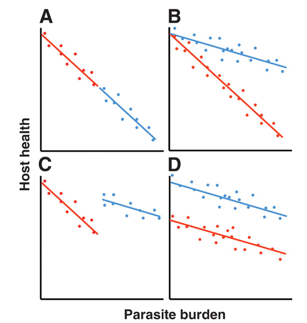
--------------------------     -------------------------
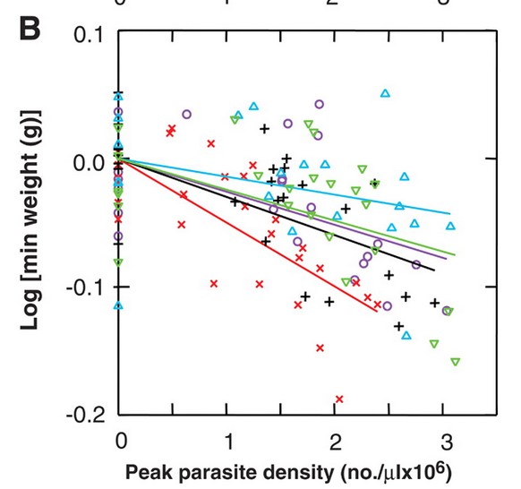     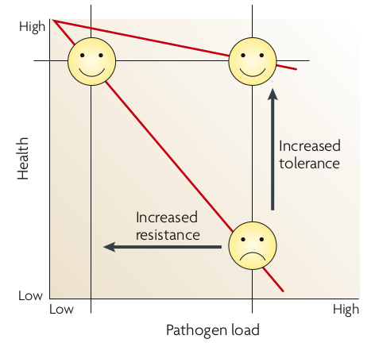


## Disentangling the history/origin of deleterious recessive Mendelian alleles

- Genetic *polymorphisms* are interesting; why haven't they been eliminated or fixed?

## hypotheses

- genetic drift (null)
   - historic size of populations? (historical records, population genetics [*coalescents*])
   - strength of selection/maintenance in large populations?
- heterozygote advantage
- frequency-dependent selection (RQ vs. arms race)

## Tay-Sachs disease

* Lethal abnormality in hexosaminidase A (lipid metabolism);
early (infant/toddler) death
* Mendelian, recessive lethal ($s=1$)
* allele frequency $\approx$ 1/300 in US population, 1/30 in Ashkenazi (E. European) Jews: also high in French Canadians, Cajuns, Pennsylvania Dutch ...
* Population-genetic evidence suggests drift
* (Terrible!) speculation about **overdominance** or **heterozygote advantage**: Tb resistance, intelligence: ???  
[@spyropoulos_taysachs_1988;@frost_taysachs_2012;@frisch_origin_2004]

## phenylketonuria (PKU)

- metabolic disorder (phenylalanine)
- many different mutations
- homozygous PKU historically lethal (**selection coefficient** = 1)
- PKU alleles are old

## PKU incidence [@hillert_genetic_2020]

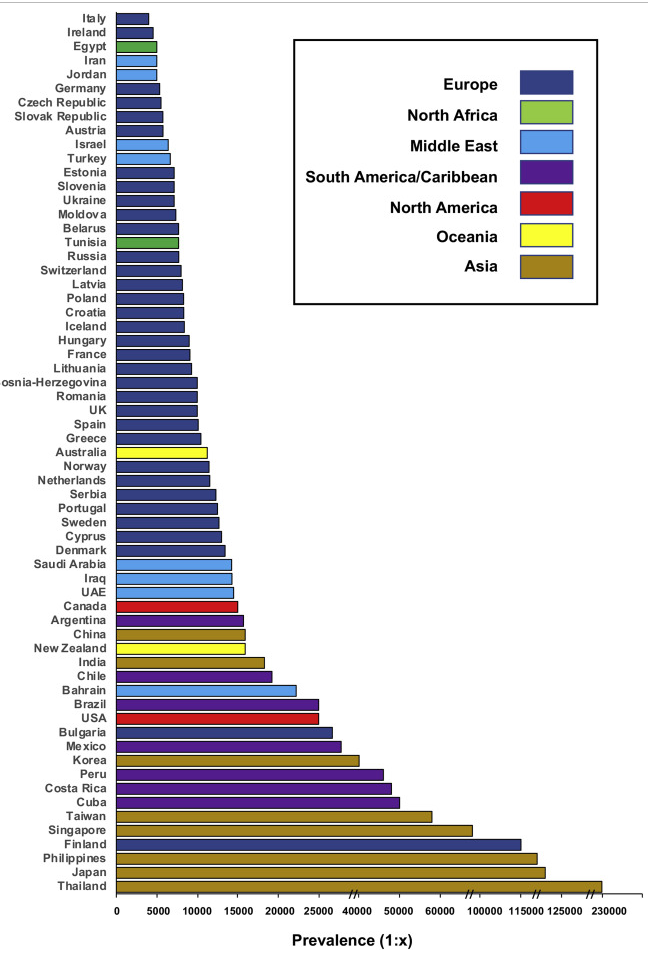

## PKU genetics

why not drift?  [@krawczak_role_2003]

- many different mutations
- present across many populations
- populations without history of being small
    - e.g. Irish gene pool from $\approx$ 2500 BC
	- population size was 100K-200K
	- current expected frequency 0.6% is twice as high as expected
	
## PKU genetics: conclusion

- calculation from genetic models
- heterozygote advantage probably $\approx$ 1.5%
- hard to measure directly!
- probably due to higher phenylalanine levels in heterozygotes
- phenotypic effects?
     - higher birth weight
	 - mycotoxin resistance?
	 - starvation resistance?

## Sickle-cell

* overdominance  
(heterozygote advantage)
* selection for *falciparum* malaria resistance
* geographic patterns;  
consistency with malaria distribution [@pielGlobal2010b, @esohEvolutionary2021]
* mechanistic basis for protection
* evidence for positive selection (age??)

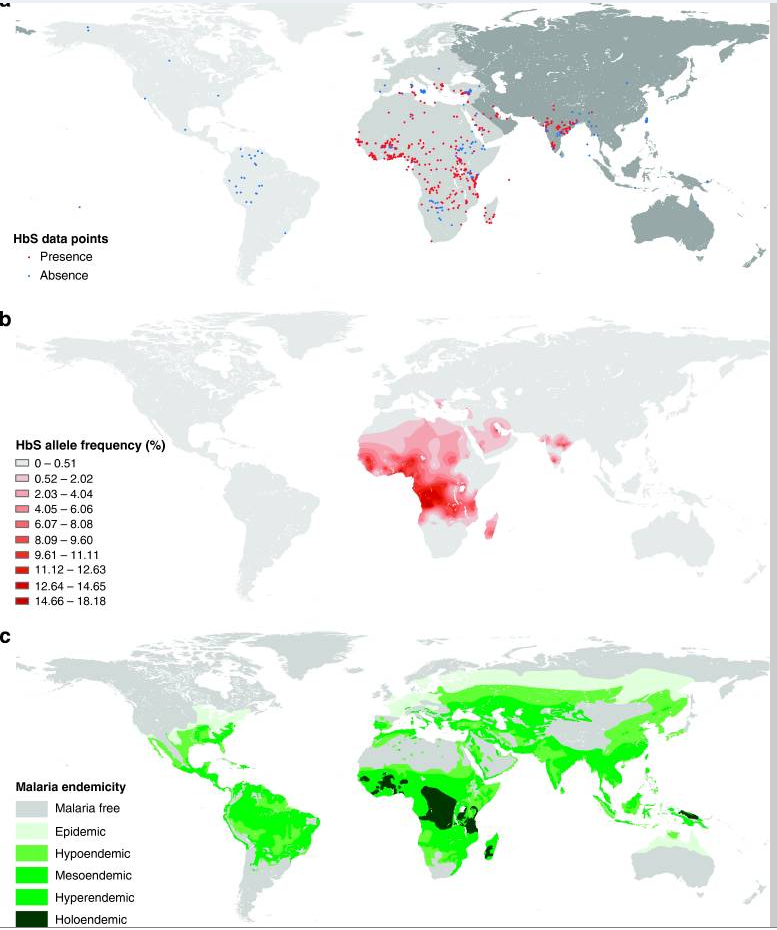

## Balanced polymorphisms

* Sickle-cell (and all cases of overdominance) depends on genetic makeup of the *population*
* chance of mating with a carrier is higher when allele is more common
* easier to do the math at the level of alleles

## Selective sweeps

* strong selection on an allele
* individuals carrying that allele have high fitness
* lower (gene-specific)
**effective population size**
* neighbouring loci carried along as **haplotypes**: **hitchhiking**
* haplotypes gradually erode (narrow) by recombination
* e.g. MHC class I variability in chimpanzees decreased ~ 2-3 mya [@de_groot_evidence_2002]

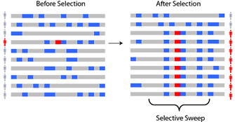

## Selective sweep: chromosome pattern

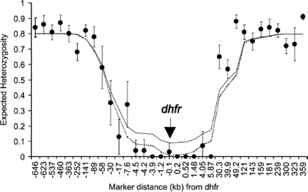

[@nair_selective_2003]

## Other malaria-protective variation

* hemoglobin variants:
    * blood groups, Rh-negativity  
  (older than malaria)
    * thalassemia
* enzyme variants:
    * GP6D deficiency/favism
        * Mediterranean populations
    	* X-linked
	    * arose 5-10K years ago: agriculture?
* Duffy antigens (protection against *vivax* malaria)
	
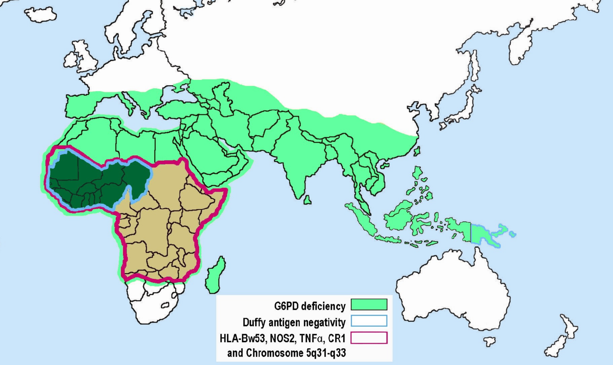

[Wikipedia](https://en.wikipedia.org/wiki/Genetic_resistance_to_malaria)


## Cystic fibrosis

* Lethal lung disease: mucus build-up  
(1/4 chance of death before 30, previously much higher)
* 4% carriers in European whites (1/2500 diseased: $2pq=0.04 \to q^2=0.0004$)
* Mutated cftr gene, changes chloride metabolism;   
age approx. 50 KYA
* Protection from cholera? (First European cholera epidemic 1817) Dehydrating intestinal diseases?  Typhoid?
* **Pleiotropy** (multiple effects from one gene)

## HIV

From @galvani_evolutionary_2005:

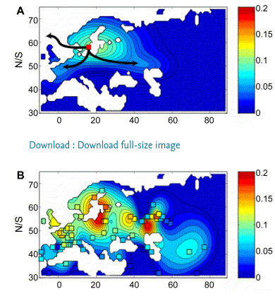 

- where does CCR5-$\Delta 32$ come from?
- homozygous individuals are healthy ...
- at least 5000 years old; @hummel_detection_2005; @novembre_geographic_2005; @galvani_evolutionary_2005; @liden_pushing_2006
   - "If $\Delta 32$ were neutral, population genetics theory predicts it would have to be much older given its frequency."
- high dispersal, sustained strong selection ($s > 0.1$); what selective agent? plague? smallpox?

## Summary: variation in Mendelian traits

* (relatively) simple inheritance
    * recessive/dominant, autosomal/X/Y-linked
* mechanisms	
   * drift
   * heterozygote advantage
   * balancing selection/tradeoffs; gene × environment interaction

* evidence
   * ancient DNA
   * phylogenetic patterns/*coalescent* methods to estimate origin times/places
   * biogeography/history of disease/environment
   * mechanism
   * population history

## more examples

@dominguez-andresImpact2019

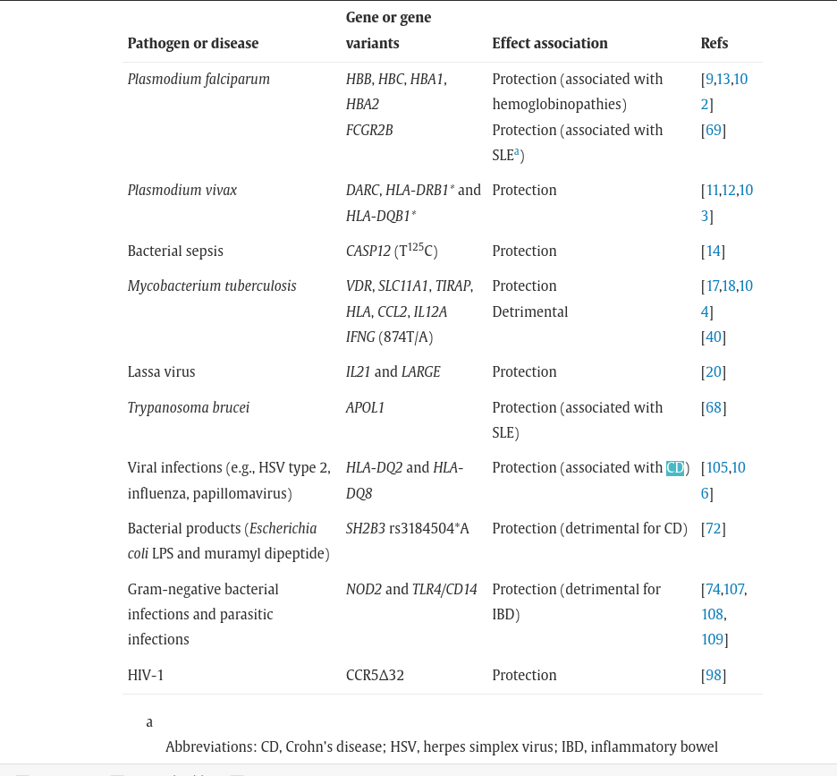

## GWAS

@mboowaHuman2018

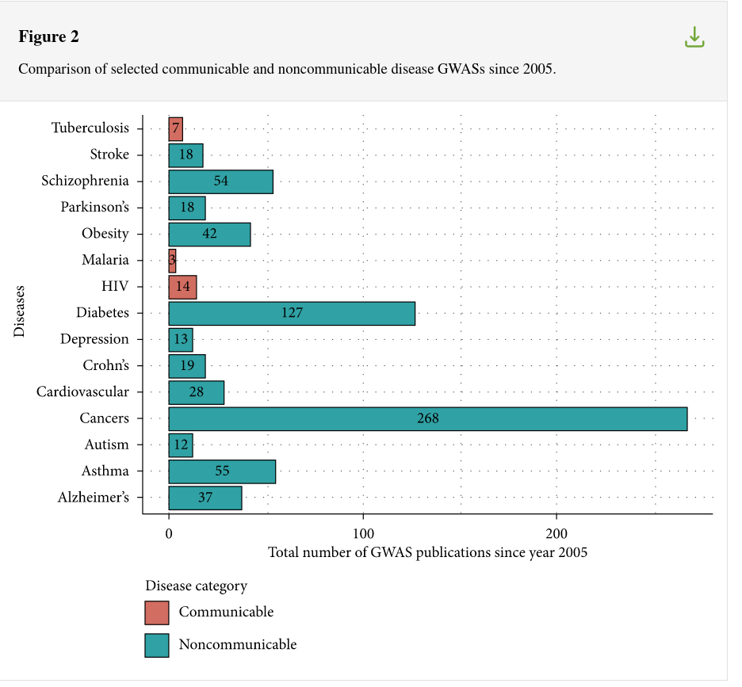

##  References
 
::: {#refs}
:::

---

Last updated: `r Sys.time()`
	
