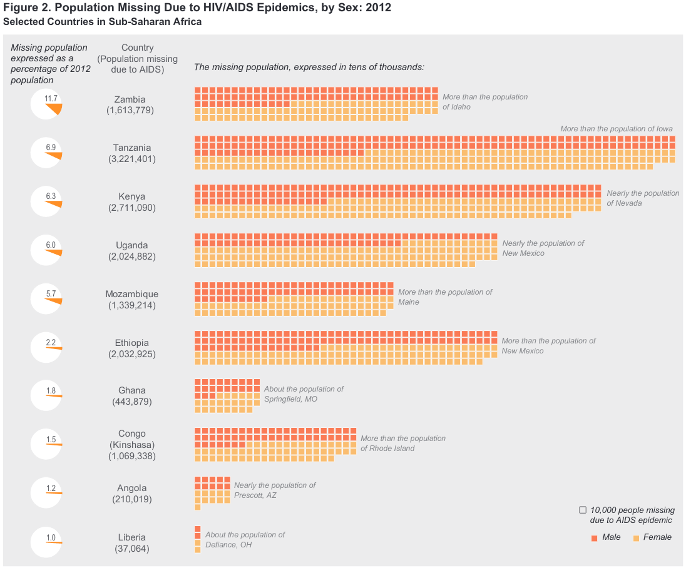
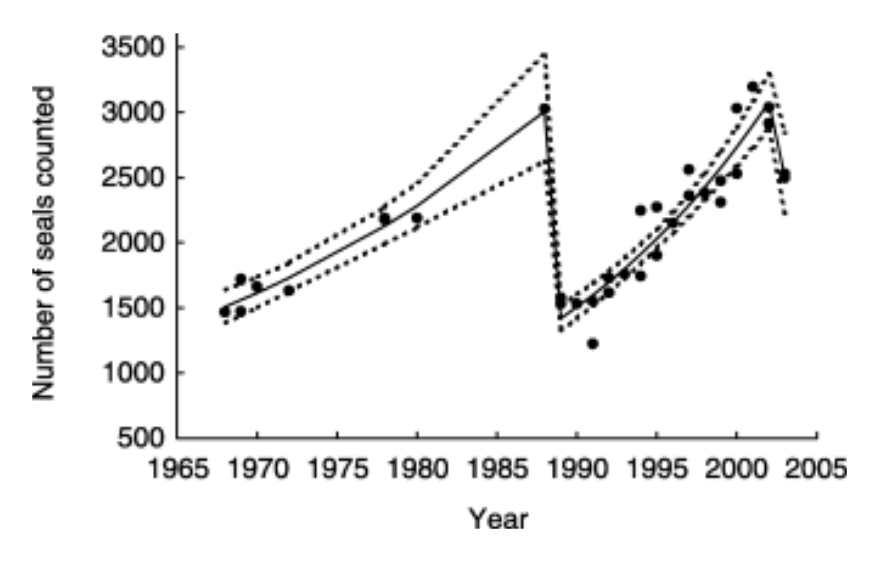
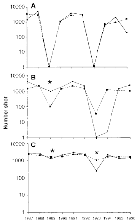

## Host populations

So far we have been talking about the population dynamics of the
pathogens themselves; now we'll discuss how parasites affect the
population dynamics of their hosts, whether wildlife (animal or plant)
or human.

## Regulation

Do parasites control population size? How?

High infection rate, *intermediate* virulence (disease-induced death rate) have the greatest impact on a population (because virulence lowers $R_0$ by killing hosts "too quickly").

Can parasites *regulate* a population (i.e., create density-dependent
mortality)? Historically controversial because parasites thought to
evolve towards benign (commensal) association. Many lab studies show
dramatic results (e.g. 90% reduction of mouse population with nematode
*Heligmosomoides polygyrus* [@scott_regulation_1987]: what about in the field? Easiest to detect with direct life cycles (**monoxenic**), mortality-producing.

Biocontrol with pathogens (e.g. rabbit myxomatosis, calicivirus) does
work --- although parasitoids (or toxins derived from microorganisms --
Bt) are also common. Another example: *Cactoblastis* moth, introduced to
Australia in 1925 to control non-native *Opuntia* cactus. But ... both
myxomatosis and *Cactoblastis* are also causing problems in places where
their hosts  are valued (native cactus), Iberian lynx that
depend on rabbits in Spain [@zimmermann_renowned_2000;@cooke_rabbit_2002;@real_conservation_2009].

## Extinction

The simplest epidemic models suggest that parasites should go extinct
before their hosts do (density threshold), so parasites should not be
able to drive their hosts extinct. However, there are many exceptions
to the rule.

- small populations (e.g. golden toad/Bd, black-footed ferret/CDV, arctic fox/mange)
- reservoir hosts (e.g. Hawai'ian birds/malaria)
- frequency-dependent transmission (e.g.? koala/chlamydia)

## Humans: historical and modern

Plague of Athens (430-429 BC) killed 25% of the population of 155,000
(measles?); also 25% in Rome in AD 165-180 (smallpox). Black Death
(1347) killed 25%-50% of the population of Europe (setting back
centuries of growth since 800). Population of Mexico dropped from 20
million to 3 million between 1518 and 1568, then to 1.6 million.

Malthus comments on effects of *crowding* on disease.

```{r eval = FALSE, echo=FALSE,fig.height=5, fig.width=6}
## spent a bunch of work on this but not what I wanted?
dd <- (read.table("worldpop.txt", header= TRUE, comment = "#")
  |> subset(year >= 0)
)
par(las =1 , bty="l")
plot(world_pop ~ year, data = dd, log ="y",
     type = "b",
     xlab = "Year", ylab = "population (millions)")
```

Demographic impact of HIV/AIDS is extremely significant: can convert
positive to negative growth rates in worst-affected countries.

 

[@us_census_bureau_data_2013]

```{r eval = FALSE, echo=FALSE, fig.width = 5, fig.height = 5, fig.cap = "AIDS impact on demography"}
x <- read.table("AIDSdemog.tab", header=TRUE)
## magnitude of difference
d <- x[,4]-x[,5]
x <- x[order(d),]
n <- 5  ## number of counties to include
par(las=1,mar=c(4,6,1,1),cex=1,lwd=1,mgp=c(2.5,1,0))
barplot(t(as.matrix(x[1:n,4:5])),
        beside=TRUE,
        names.arg=as.character(x[1:n,1]),
        horiz=TRUE,
        xlab=" ",
        xlab = "population growth rate")
legend(1.6,10,fill=gray(c(0.3,0.8)),
       c("with AIDS","without AIDS"),
       cex=0.8,bty="n")
```

# Cycles

Simple models of "natural enemies" strongly suggest that enemy-victim
interactions can lead to population cycles. These cycles are well
established for epidemics in human populations (e.g. measles, rubella,
chickenpox --- the cycles are not in populations of humans, but in the
populations of parasites or "infectives") and for predator-prey systems
(lynx-hare). Do infectious diseases drive host population cycles?

## Seals and phocine distemper virus

Harbor seals in northern Europe underwent a severe outbreak of a
previously unrecognized morbillivirus, now called phocine distemper
virus, in 1998.

{height="3in"}

[@thompson_population_2005]. There was another major epidemic in
2002. @harwood_mass_1990 present evidence of sporadic outbreaks of
die-offs and pneumonias in seals (ca. 1758, 1813, 1836, 1869--70,
1930s). The epidemics are consistent with population die-offs and
recovery, although the detailed epidemiology and demography is still an
active area of research.

## Forest lepidoptera

Another example [@myers_can_1988] cycles of forest lepidoptera. About 80 species (1-2%)
of forest lepidoptera (caterpillars) experience outbreak dynamics; of
these, 18 species display regular, cyclic fluctuations.

The cycles are very clear (8--11 years, often highly synchronized across
broad geographic regions). Possible hypotheses for why this happens
include:

- **top-down control** (predators): changes in predator populations (e.g. birds)
(probably not: bird population densities don't change fast enough to
control caterpillars. Parasitoids??)
- **bottom-up control**: changes in plant density *or* plant quality
(plant density doesn't work - very few trees die from caterpillars -
but plant quality might. However, experimenters have had extremely
mixed results manipulating food quality)
- **weather** (doesn't work by itself; wide variation in local conditions)
or interactions of weather with other factors
- changes in **insect quality**, possibly as a result of changes in plant
quality or other competitive effects
- **parasites**: specifically, nuclear polyhedrosis viruses *Entomophaga maimaiga* (fungus)

The only time that an outbreak has been stopped by experimental manipulation is
by spraying with NPV (an outbreak of tussock moths in 1981).

## Red grouse and *Trichostrongylus tenuis*

What about regular *cycling* in time?  [@hudson_prevention_1998]

## Basic natural history

Not much "natural" about the demography and ecology of Scottish
red grouse (*Lagopus lagopus scoticus*) in the 20th century. Red grouse
live on heather moors in northern England and Scotland. They are
herbivores, eating only heather, with special intestinal adaptions
(*caeca*, which are fermenting chambers off the main intestines) for
subsisting on the relatively woody vegetation. The nematode
*Trichostrongylus tenuis* lives in these caeca in (typically) large
numbers. *T. tenuis* is monoxenic, with free-living stages (pooped out
by the grouse) that crawl up to the top of the heather to be eaten by
grouse. Grouse live at relatively high densities, protected from
predators (foxes, raptors) by gamekeepers. They are shot every year by
rich people with shotguns.

*Bag records*, numbers of grouse shot on each moor in each year, have
been recorded in some cases since 1880. They show clear patterns, with
4-6 year cycles in the north of England and 7-10 year cycles in
Scotland. The bag records are reasonable, although not perfect,
measurements of population density: hunting effort is relatively
constant between years, although it does drop if grouse numbers are too
low and it historically dropped between First and Second World Wars,
because either the aristocracy or the gamekeepers went off to war.

There are multiple hypotheses for the cyclic changes in population
density; the two main ones are changes in behavior (aggression etc.) and
host-parasite cycles.

Evidence for host-parasite cycles:

- Higher survivorship of grouse treated with anthelminthics
- Higher fecundity of grouse treated with anthelminthics
- Parasite densities (mean worm burdens) oscillate out of phase with
population densities
- Treatment experiment: reduces amplitude of fluctuations
-   General consistency of model predictions with data, including
variation of cycles from south (northern England) to north
(Scotland); seems to be related to *arrested development* of
nematode larvae in cold weather, which slows things down

This is not the last word, but there's a lot of evidence.



##  References
 
::: {#refs}
:::

---

Last updated: `r Sys.time()`
