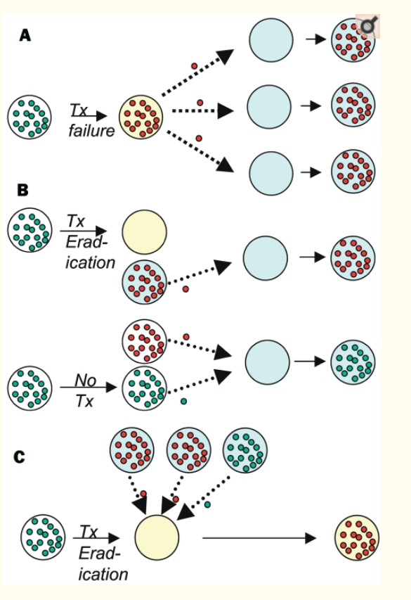
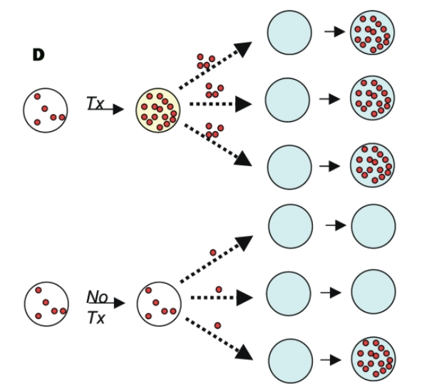
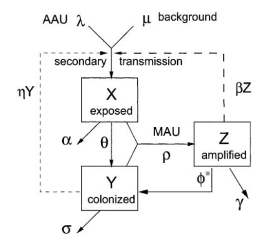
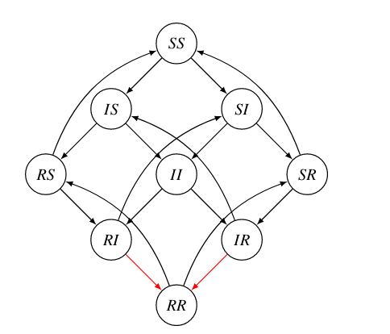
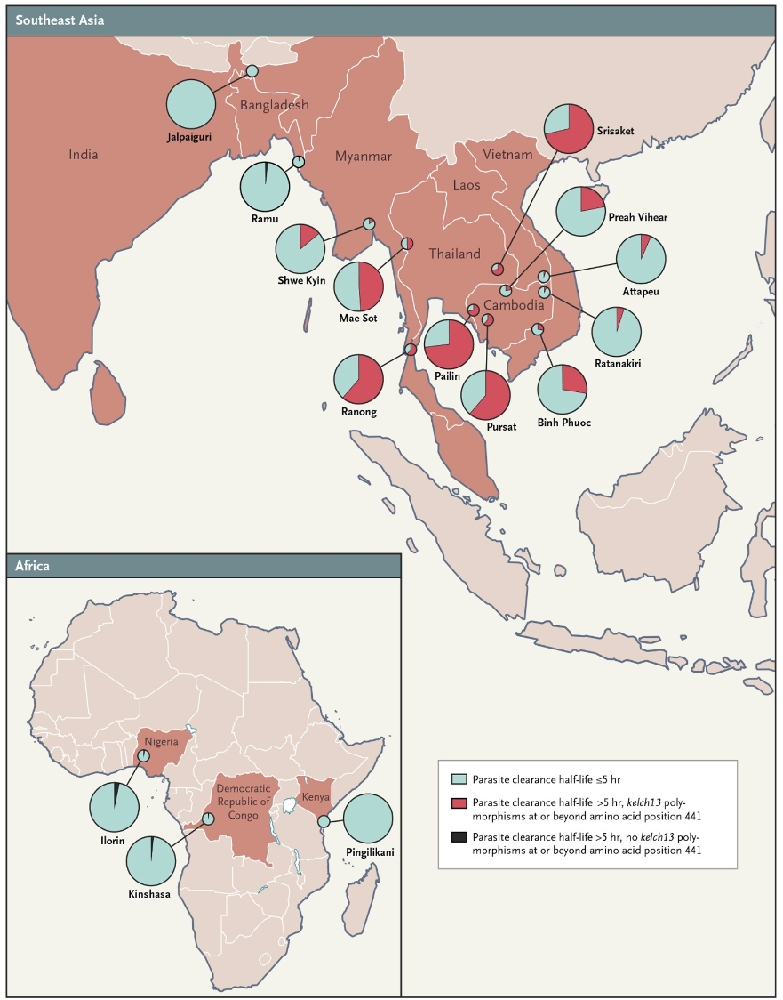
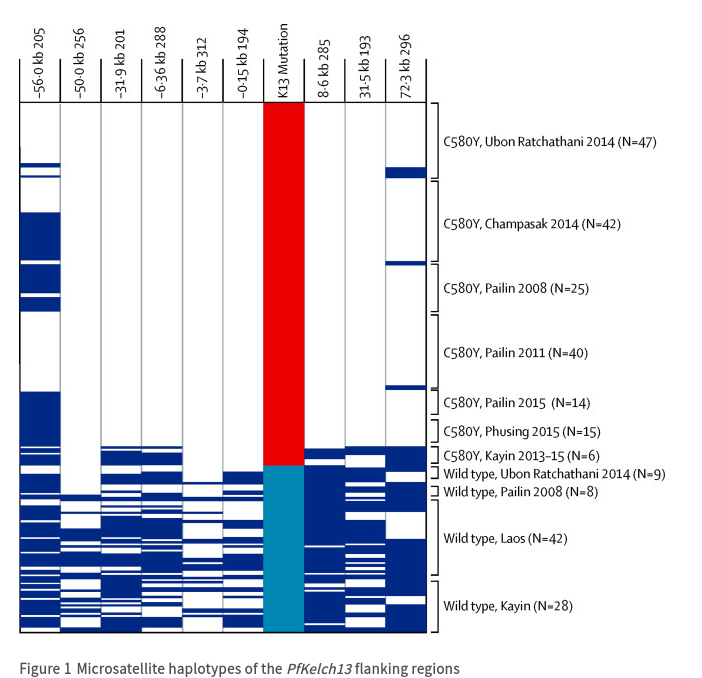

```{r setup, include = FALSE}
library(knitr)
opts_chunk$set(echo=FALSE, fig.width=6, fig.height =4)
```

# General principles

- two stages of evolution: *de novo* mutation and selection
- limiting factors in *de novo* mutation
    - mutation rate (per locus/per genome)
	- population size
	- generation time
	- rate appearance of new mutations = (mutation rate × pop size)/(generation time)
	- mutational **spectrum**: what can mutations achieve?
- limiting factors in selection:
    - selection differential
	    - benefits (= prob of encountering antibiotic × benefit of resistance)
	    - costs [metabolic/energetic; reduced efficiency]
		    - **compensatory** mutations (reduce cost)
	- pop size (drift vs selection; bottlenecks in between-host transmission)
	- variation in selection (within- vs between-host)
	- recombination and/or horizontal transmission via mobile elements (plasmids etc.)
- competition between susceptible and resistant strains [@lipsitch_antimicrobial_2002]

____________________________   _______________________________
   


a. resistant bacteria take over during treatment failure (within-host competition)
b. resistant bacteria take advantage of reduced transmission by treated hosts (between-host)
c. resistant bacteria colonize a treated host (empty patch)
d. resistant bacteria take advantage of side effects (bystander effects)

# Bacteria 

## Mechanisms

- because bacteria and animals are biochemically different, can use substances that disrupt bacterial but not animal metabolic processes
- many biologically derived
  - fungi (penicillin!) [@karwehl_exploitation_2016]
  - soil bacteria (esp *Streptomyces*; streptomycin, tetracycline)
  - (also chemical/synthetic, e.g. derived from dyes - *sulfa drugs*)
- because antibiotics have been around "forever", so has antibiotic resistance [@dcosta_antibiotic_2011]
   - but presence **as mobile elements** may be recent, human/animal derived [@ebmeyer_framework_2021]
   - often present in antibiotic *producers* [@benveniste_aminoglycoside_1973]
- huge problem, e.g. mdrMRSA ([multi-drug resistant], methicillin-resistant *Staphylococcus aureus*), extensively drug-resistant (XDR) tuberculosis [@CDC_extensively_2020]
   - threatens to wipe out disease cures ...
- horizontal transfer is rampant
   - resistance gene can be anywhere in the microbiome ...
   - **collateral** or **non-target selection** [@llewelyn_antibiotic_2017]
   - also makes it easier to lose resistance when no longer required
   - thus resistance is usually/often pre-existing
- mechanisms of action:
    - pumps ("efflux system": remove toxic substances from the cell)
	- inactivation or degradation/detoxification
	- altered pathways?

- antibiotics are *effectors* (not recognizers)
- cost of resistance; are resistance alleles lost or compensated in the absence of antibiotics? [@bjorkholm_mutation_2001;@levin_compensatory_2000-1]

## Implications for antibiotic use

- avoid overuse! "antibiotic conservation"
- regulate agricultural use
    - for human-to-human transmission, regulating agriculture may be too late once resistance is already established in humans  [@smith_animal_2002]

    
	- but regulation still helps with spillover infections [@lipsitch_antibiotics_2002]
- "the long-term benefit of single drug treatment from introduction of the antibiotic until a high frequency of resistance precludes its use is almost independent of the pattern of antibiotic use" [@bonhoeffer_evaluating_1997]
- "cocktails" may be best; varying treatments in space is better than cycling [@bergstrom_ecological_2004]
- treating for longer increases collateral selection [@llewelyn_antibiotic_2017]
- contrast: Tb (chronic disease, resistance from point mutations)

# Viruses

- similar biochemistry to hosts
   - often fought by priming immune system, i.e. *vaccination*
   - resistance via **recognition escape** rather than disabling effectors
   - usually **strain replacement** rather than within-lineage selection on escape alleles
        - horizontal transfer/lineage-mixing does happen via recombination (especially influenza, phages), but less typical [@wuGene2023; @mavrichBacteriophage2017]
- very high mutation rate
   - *de novo* mutation is a bigger problem
- HIV
   - single-drug resistance evolves quickly [@bonhoeffer_human_1997]
   - target non-host-like biochemistry: nucleoside and non-nucleoside resistance transcriptase inhibitors; protease, integrase inhibitors
   - HAART [@eggleton_highly_2022]; e.g. standard South African regimen includes tenofovir, lamivudine (nucleotide analog), dolutegravir (integrase inhibitor) [@sa_haart_2019]
   - keeping load low reduces transmission *and* within-host evolution of resistance
   - between-host transmission maybe less important because of early infectivity
- strain replacement
   - COVID-19! alpha, delta, omicron [@ferguson_report_2021]
   - influenza, every year (*antigenic drift*)/pandemic (*antigenic shift*)
   - other examples: *Haemophilus influenzae B* [@adam_changing_2010]
   - human papilloma virus: maybe not? [@covert_evidence_2019;@man_human_2021]
   - **not**: smallpox (gone), rinderpest, chickenpox, measles, rubella 
   - importance of focusing on **conserved** viral **epitopes**; universal flu vaccine? [@wangProgress2022] (back to the *mutational spectrum*)
   
<!--  -->

- back to bacteria: vaccine-preventable *Bordetella pertussis*, resurgence and evolution of immune evasion (?) [@gent_small_2012]

(**to be added, maybe**)

## malaria control

[Twitter](https://twitter.com/ProfDavidLSmith/status/1504110201875562504):

> reading various malaria documents that discuss having endemic malaria today despite spending ~$4.1B/yr, I always want to insert the comment, "Well, WTF did you expect? No one who understands malaria believes elimination would be possible without spending at least $10B/yr"

Main components:

- antimalarial drugs
- vaccine (children only, max effectiveness $\approx$ 40%, safety concerns ...) [@seo_cost-effectiveness_2014; @jarry_malaria_2021]
- vector control
	- indoor residual spraying (lethality + avoidance)
	- treated bednets (lethality + avoidance)
    - biocontrol (e.g. *Gambusia*, "mosquito fish")
    - improved housing? [@musiime_house_2022]
	
## malaria resistance to antimalarial drugs

- protozoan parasite
- quinine, chloroquine [@achan_quinine_2011;@ashley_spread_2014]
- artemisinin (and combination therapy, ACT)



From @ashley_spread_2014

@rosenthalHas2021: "Recent data suggest that we are on the verge of clinically meaningful artemisinin-resistance in Africa"



> From @imwongSpread2017a. Red box=C580Y. Light blue box=wild type. Each row represents one parasite isolate; white cells indicate identical microsatellite alleles compared with the most frequent allele and dark blue cells indicate differences.
containment strategies: eliminate *falciparum* malaria from Greater Mekong region or "firewall"?

## vectors and resistance to insecticides

- DDT [Wikipedia](https://en.wikipedia.org/wiki/DDT#Mosquito_resistance)
   - environmental side effects
	 - fast evolution of resistance: 6-7 years [@gladwell_mosquito_2001]
- other methods?
   - sterile male release (irradiation, *Wolbachia*) [@atyame_comparison_2016]
   - **gene drive** [@burt_gene_2018] and/or bacterial infection [@dennison_mosquito_2014]
        - reduce vector competence
		- shift sex ratios toward males
   - evolution-resistant insecticides: shorten host life span [@mcmeniman_stable_2009; @koella_towards_2009]
        - weak selection against late-acting processes [@medawar_uniqueness_2019]
        - late-acting insecticides (W. or fungal)
		- larvicides: resistant phenotypes are smaller/short-lived

##  References
 
::: {#refs}
:::

---

Last updated: `r Sys.time()`
	


