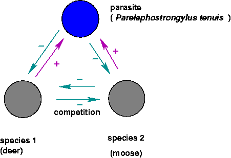
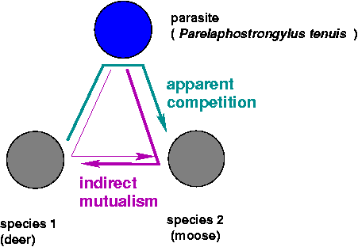
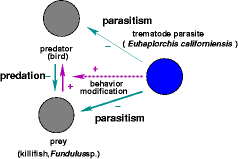
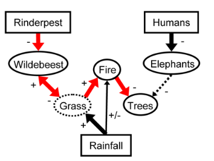
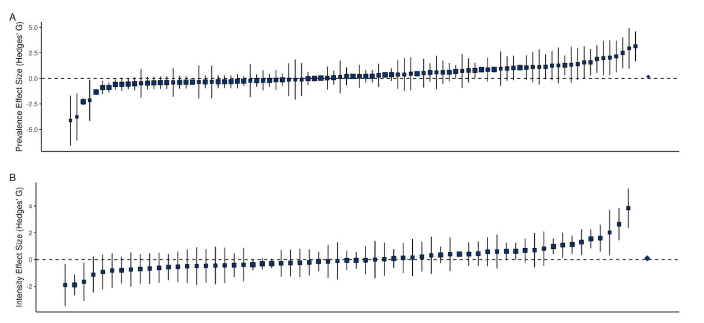
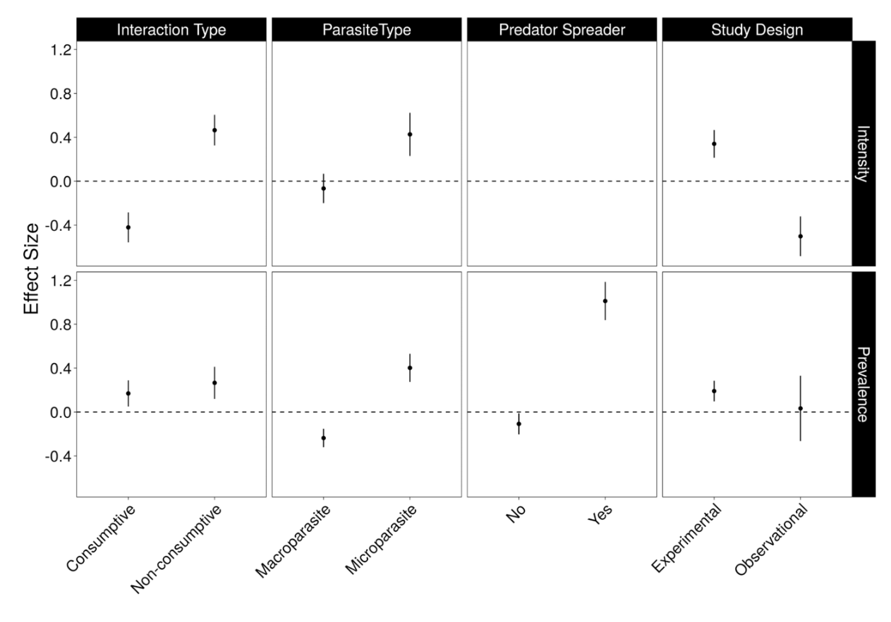

Parasites can have large effects on their host populations and communities; can

- determine the competitive balance between two species, whether one species can invade or coexist with another;
- change the flow of energy through and relative balance of different trophic levels;
- act as "ecosystem engineers" to change the environment in which other organisms live;
-   have cascading effects on entire ecosystems, determining their biomass or diversity.

## Indirect interactions

- **Direct** interactions among species: (e.g.) parasites change the
fecundity and mortality of their hosts, leading to population cycles.
- **Indirect interactions**: the direct (-/+) interaction between
parasites and one host leads to a change in the interaction between two
hosts, or between one host and another species in the community. These
interactions can be **density-mediated** (parasite changes the
population density of the target host, benefiting the second species
indirectly) or **trait-mediated** (parasite changes behavior of its
host, which hurts or helps another species).

- Direct effects between deer, moose, and parasite populations:\
{height="1.5in"}

- The indirect interactions:\
{height="1.5in"}

- Indirect effects: a parasite that changes the behavior of its host to
encourage trophic transmission:\
{height="1.5in"}

@lafferty_ecosystem_2008

Costs and benefits of parasitism: individual-level vs. population-level
effects.

## Parasite-mediated coexistence [@combes_parasites_1996]

- *Drosophila melanogaster*, *D. simulans*, *L. boulardi* (parasitoid
wasp): exclusion by *melanogaster* in absence of *boulardi*;
coexistence in presence of *boulardi*; exclusion by *simulans* at
lower temperature with *boulardi* [@combes_parasites_1996]

- *Tribolium castaneum*, *T. confusum* (flour beetles), *Adelina
tribolii* (sporozoan parasite) [@park_interspecies_1948]

- Prevention of mixing because hybrids are less resistant to parasites? (**outbreeding depression**)

## Parasite-mediated invasion [@strauss_invading_2012]

- human movement: Europeans to the New World, Europeans to Africa
- introduced parasites: e.g. *Acipenser stellatus* (from Caspian to Aral Sea), carried *Nitzchia sturionis* (gill monogenean), severely reduced populations of *A. nudiventris*

- Invasive species and the **natural enemy hypothesis**

## Parasite-mediated resistance to invasion 

- *Parelaphostrongylus tenuis* (meningeal worm): kills moose (*Alces alces*) and caribou (*Rangifer tarandus*) in clinical infections (brain pathology), doesn't kill white-tailed deer. Moose density inversely correlated with density of *P. tenuis* eggs in deer feces.

*P. tenuis* has a two-host life cycle, from gastropods which are eaten
accidentally by grazing ungulates and back again (via excreted eggs
which hatch into larvae and bore into the gastropods when they crawl
over the larvae).

In the absence of the worm, moose can outcompete white-tailed deer for
forage. Has *P. tenuis* has caused the rise of deer and the decline of
moose in the southern boreal forest? Do deer and *P. tenuis* prevent the
reintroduction of moose?

@schmitz_parasite-mediated_1994: macroparasite model with two possible definitive
hosts, moose and deer, which also compete with each other. *P. tenuis*
kills moose, no effect on deer. Model suggests that (depending on
parameters that we don't know), moose could outcompete deer, be
outcompeted by deer, or coexist even in the presence of deer and *P.
tenuis*.

- just because a parasite kills a host in a clinical setting doesn't
mean that the parasite will necessary reduce host population
significantly
- model identifies sensitive parameters:
    - growth rate of intermediate hosts (gastropods)
    - competitive interaction between moose and deer
    - death rate of moose from parasites

## Trophic cascades and apparent mutualism

- **Trophic cascades**: alternating changes in density at odd vs. even a
food chain (prey decrease, prey's prey increase, etc.). Can parasites be
"top predators" in these cases?
- Cestodes/killifish/seabirds: whether this helps or hurts the predator
(individual or population) depends on level of parasitism, costs,
benefits. Predator population size might be max. with no parasites, but
individual decisions (presumably) maximize individual fitness.
- Toxoplasma-induced bottom-up trophic cascades (??): @skorping_trophic_2001/@pusenius_effects_2000: *more* seeds eaten in the presence of stoats than in their absence!)
- Increased flow through food webs, ecosystem efficiency?

## ecosystem engineering 

- Parasitized cockles [@thomas_manipulation_1998; @thomasParasites1999]: changed bioturbation (stirring), presence of hard surface has various impacts on community structure. Changes habitat for other species; arrows mediated through the environment.

## Large-scale community structure

- rinderpest $\to$ ungulates $\to$ grass $\to$ brushy vegetation $\to$ tsetse flies $\to$ trypanosomiasis: keeps out livestock, horses (and hence humans, or at least Europeans) [@pearceInventing2000]
- Serengeti
   - rinderpest, ungulates, vegetation, trypanosome interaction [@pearceInventing2000]
   - @holdo_disease-mediated_2009: effects of rinderpest on fire frequency and carbon storage

   
- Chestnut blight (hypovirulence, fungal superparasites)
- Cascading effects of myxomatosis in Australia and Britain [@sumption_ecological_1985]
    -   Britain: post 1954-55, increased woodland regeneration and increased grassland and cereal production
       -   increase in many inverts, voles, but some species of insects declined (Large Blue Butterfly, *Maculinea arion*, went extinct because of missing red ant species)
       -   predator populations dropped immediately, but generalists recovered
       -   other rabbit parasites declined

## Community effects on parasites

- "Keeping the herds healthy": when is predator removal bad for hosts?
- @packer_keeping_2003, @lafferty_fishing_2004
- competing effects
   - kill infected individuals, reduce density
   - *inverse* density dependence (e.g. vector-borne transmission)?

> In general, predator removal is more likely to be harmful [i.e. increase parasitism] when the parasite is highly virulent, macroparasites are highly aggregated in their prey, hosts are long-lived and the predators select infected prey

- @richards_predators_2021

##  References
 
::: {#refs}
:::

---

Last updated: `r Sys.time()`
	
