```{r setup, include = FALSE}
library(knitr)
opts_chunk$set(echo=FALSE, fig.width=6, fig.height =4)
```

## plague: first pandemic

* *Yersinia pestis*
* causative agent of the *Black Death*
* Plague of Justinian (541) - approx. 750 (ancient DNA) 

## @harbeckYersiniaPestisDNA2013
 
```{r phylo, out.width="80%"}
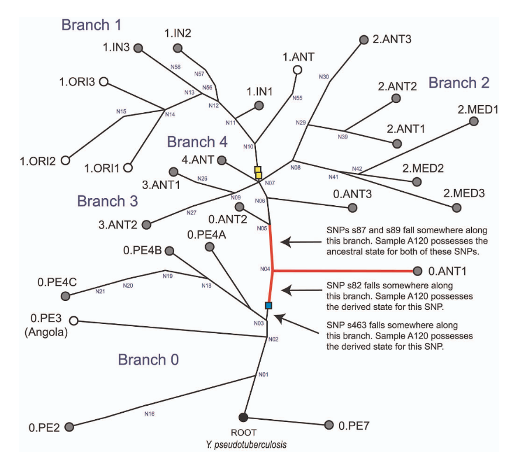
```

## second pandemic

* Black Death! 1347 onward
* human pop 450M → 350-375M by 1400
* continues until late 18th c.
* Shakespeare, Isaac Newton, etc. etc.
* also validated from ancient DNA

## 

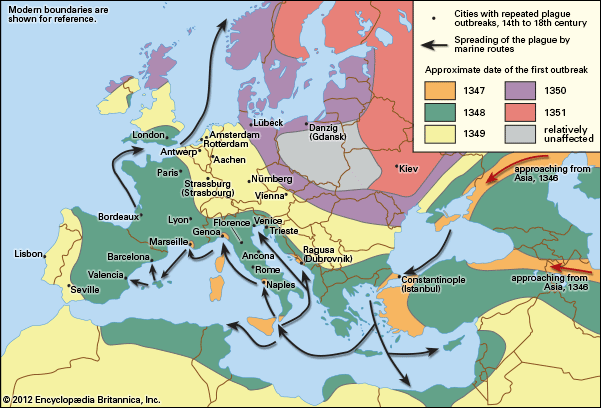

[Britannica](https://cdn.britannica.com/98/6698-004-B92A927B.gif)

## acceleration [@earn_acceleration_2020]

* get historical details on plague from wills, parish records, London Bills of Mortality ...

## 


##

```{r out.width="100%"}
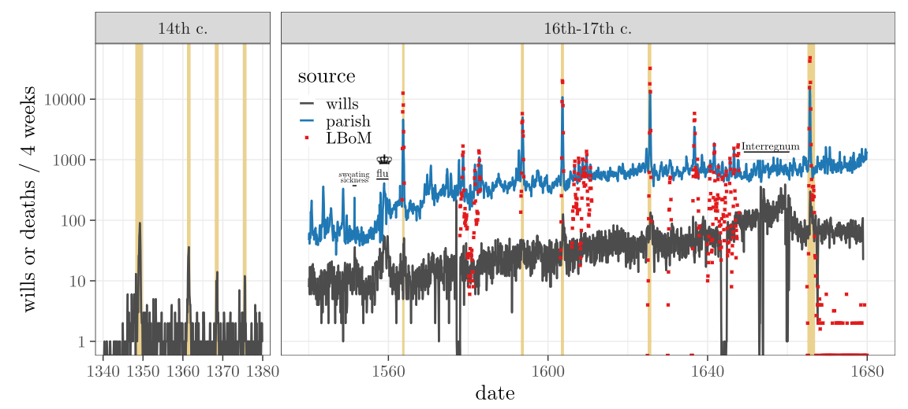
```

## 

```{r out.width="100%"}
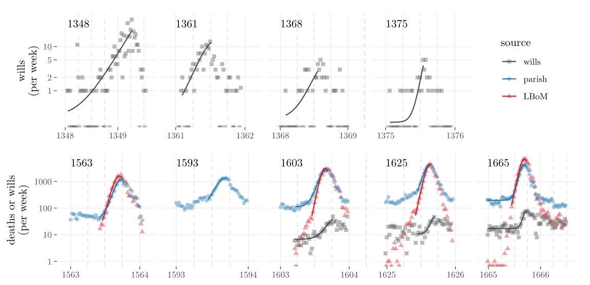
```

## 

```{r out.width="100%"}
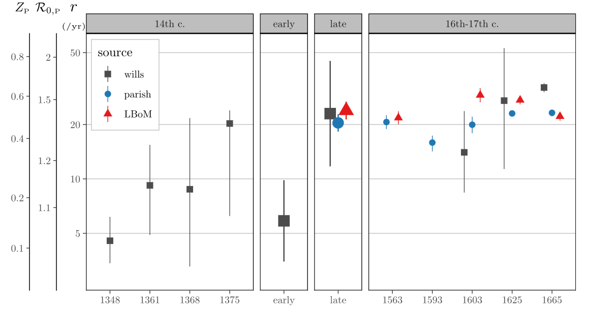
```

## acceleration: conclusions

* wills seem to be an adequate (if noisy) proxy for parish records/plague-specific mortality records (London Bills)
* epidemic speed ($r$) increased from $\approx$ 10/year to 20/year (doubling time from $\approx$ 4 weeks to $\approx$ 2 weeks)


## *Y. pestis* transmission

* Classic story: rat-flea transmission, human spillover
* Possible *pneumonic* transmission

```{r out.width="80%"}
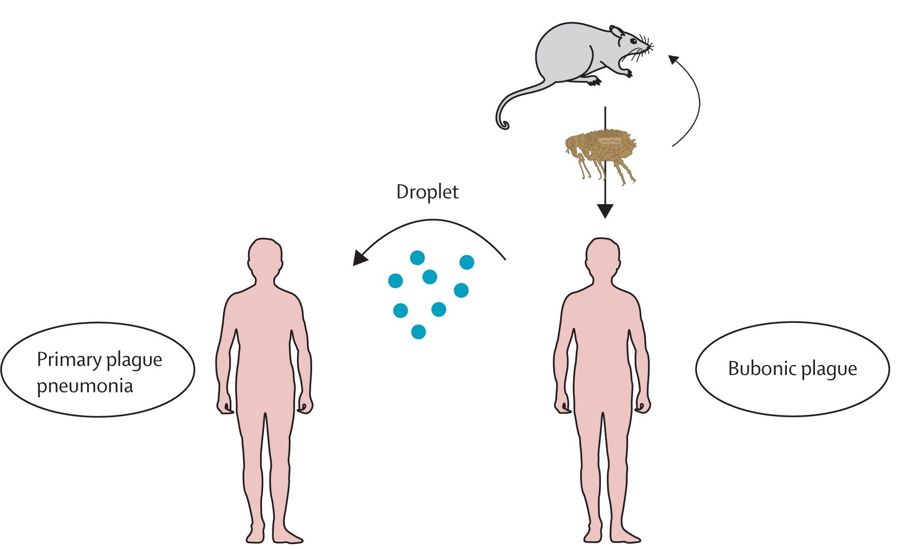
```

## Human-ectoparasite transmission

Human-to-human transmission via ectoparasites (e.g. lice)

```{r out.width="50%"}
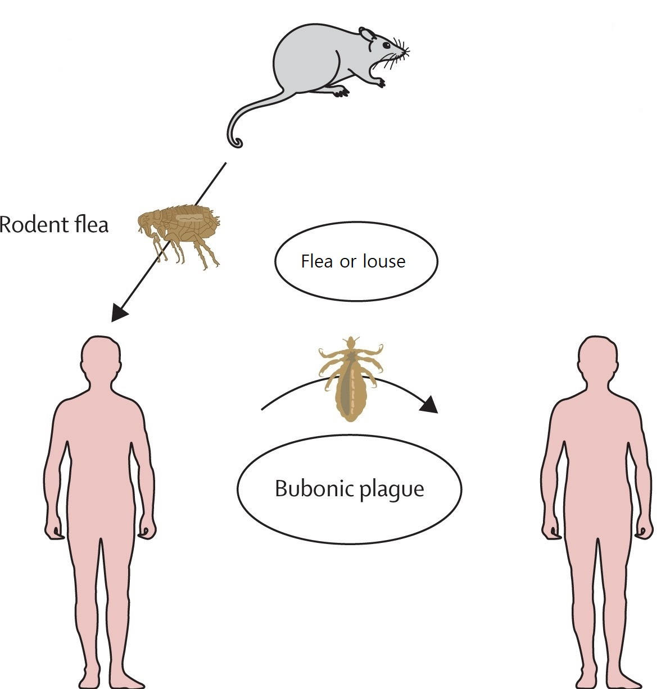
```

## data fits [@deanHuman2018; @deanEpidemiologyPlagueEurope2019]

```{r out.width="70%"}
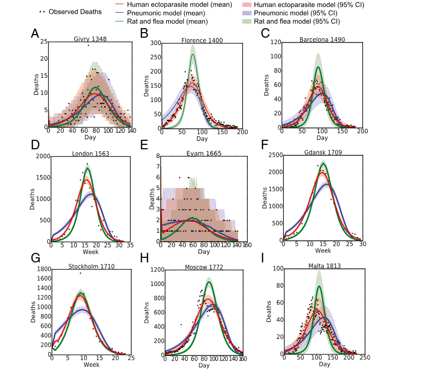
```

## combined model

```{r out.width="80%"}
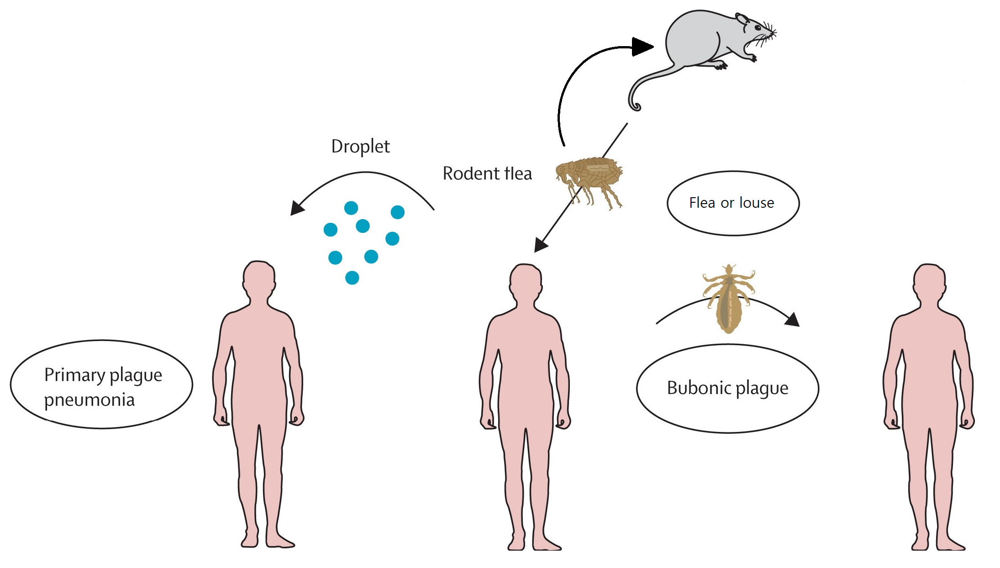
```

## box diagram

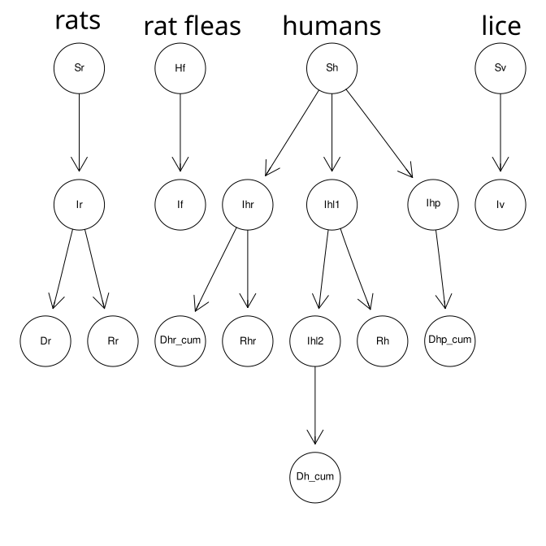

## priors

```{r out.width="80%"}
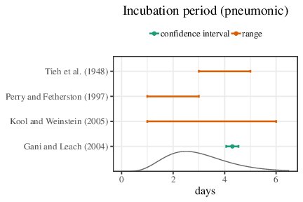
```

## results (example)

```{r out.width="80%"}
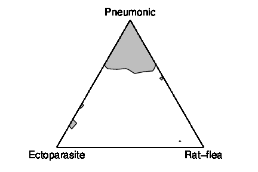
```

## results (all)

```{r out.width="100%"}
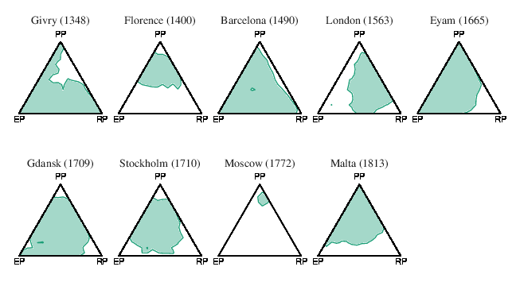
```

## virulence evolution

* @sidhuAttenuation2025
* repeated evolution of PLA (plasminogen activator) depletion across pandemics

## PLA results: first pandemic

```{r out.width="100%"}
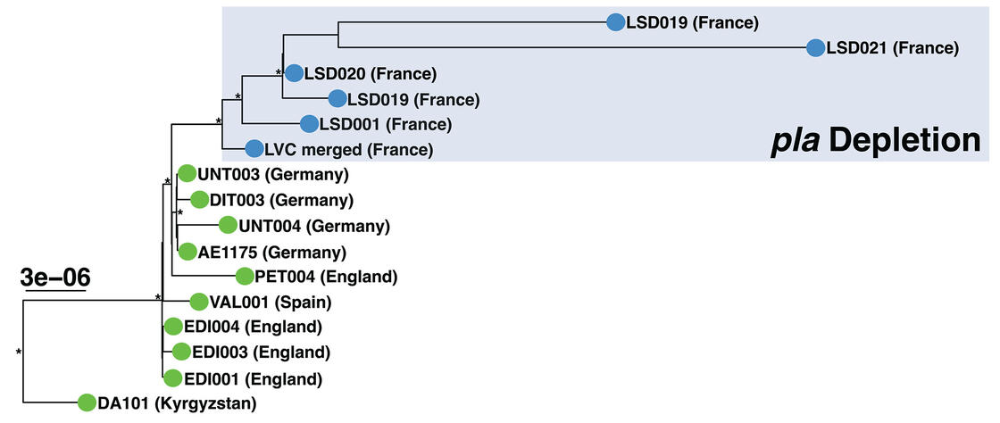
```

## second pandemic

```{r out.width="100%"}
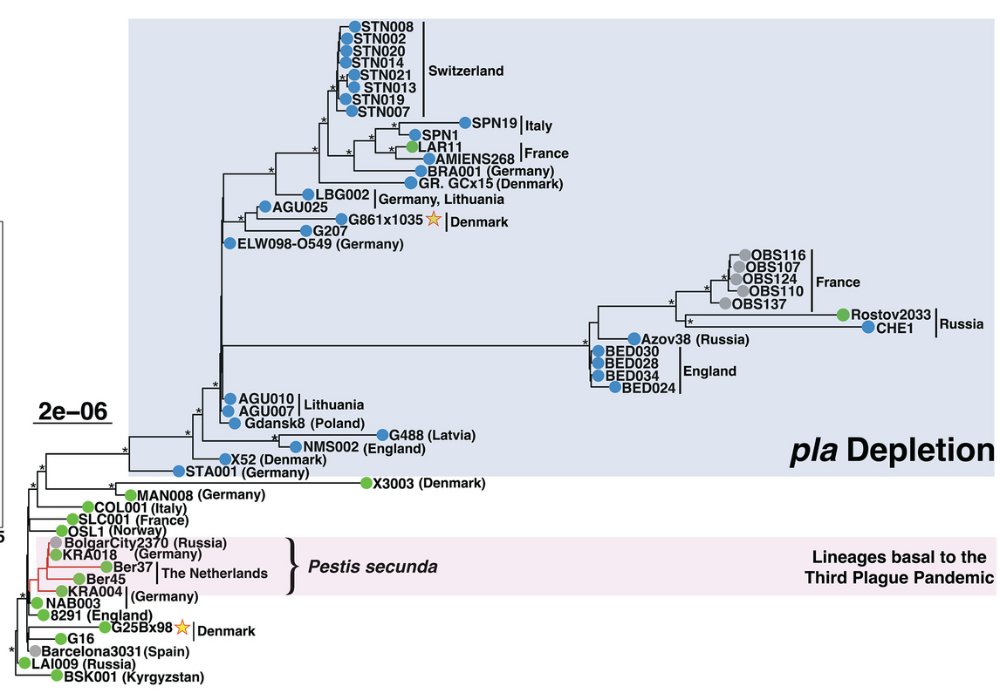
```

## third pandemic

```{r out.width="100%"}
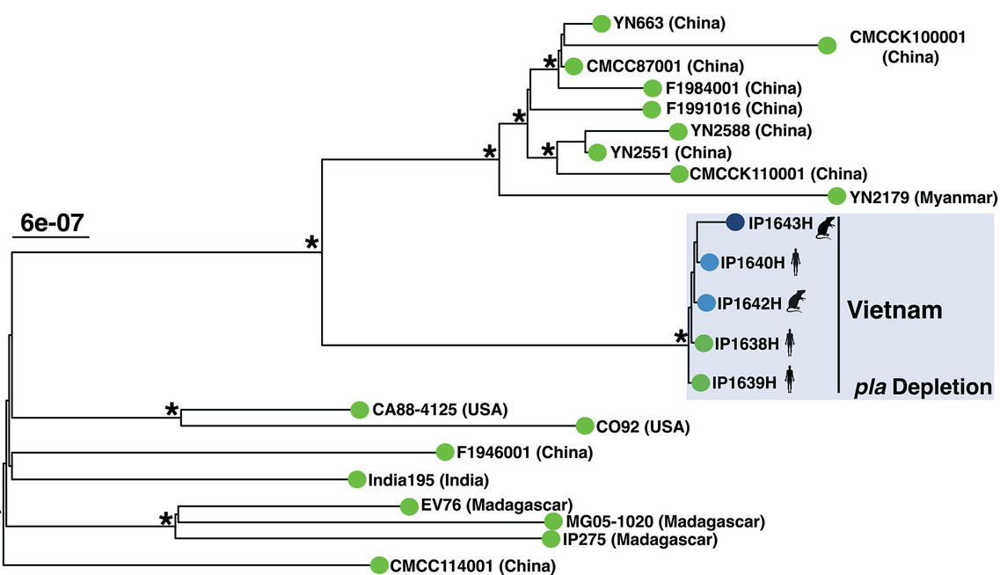
```

## PLA phenotypes

```{r out.width="100%"}
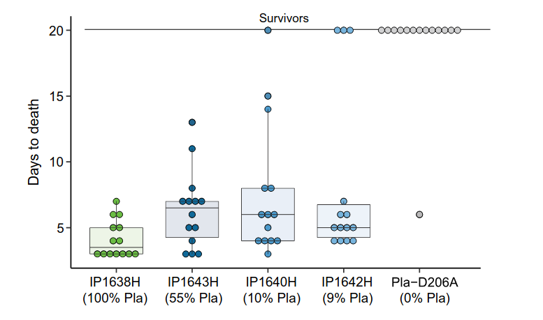
```

## evolutionary mechanisms?

* tradeoff theory *doesn't work*
* most transmission is via fleas leaving dying rats
* 'infectious period' is a burst at the end of the infection
* how can PLA-depleted strains evolve (repeatedly)?

## burnout theory

@parsonsprobability2024a

```{r out.width="50%"}
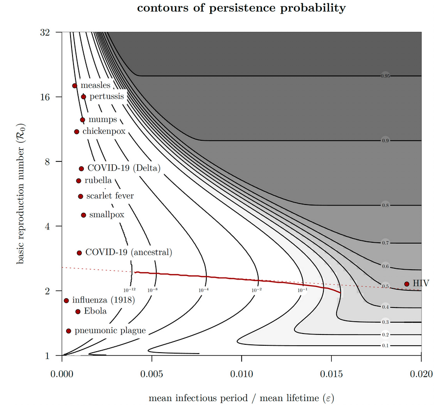
```

## metapopulation model


## metapopulation results

```{r out.width="70%"}
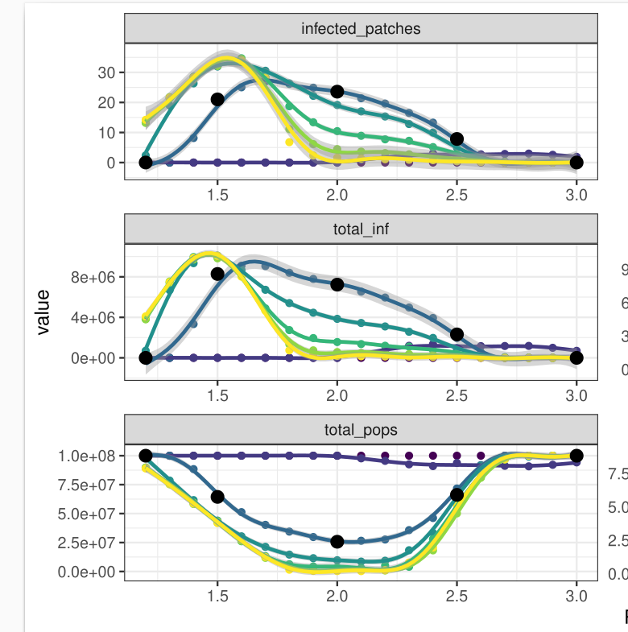
```


##  References
 
::: {#refs}
:::

---

Last updated: `r Sys.time()`
