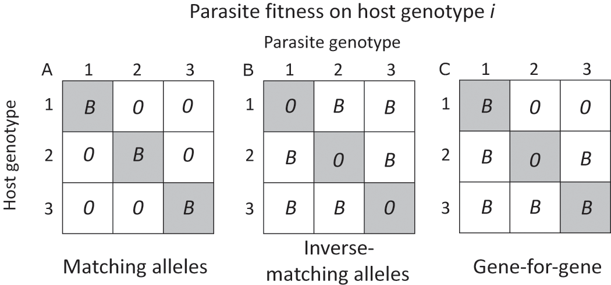

## Antagonistic coevolution

The costs of parasitism lead to **antagonistic coevolution** between
hosts and parasites.

Hosts can evolve **resistance** (typically by closing the compatibility filter) or **tolerance** (focusing on resistance this week).

@stahl_dynamics_1999: **Arms races** in a disease-resistance locus of *Arabidopsis*

- **Red Queen** (cyclic)
   - new alleles arise frequently
   - *frequency-dependent selection*: rare alleles in the parasite, or host, have an advantage
   - resistance alleles tend to be *monomorphic*
   - different possible genetic systems: gene-for-gene, matching alleles, etc.

(@gibson_genetic_2019; see also @dybdahl_parasite_2003)

- **trench warfare** (unidirectional)
  - resistance builds up until benefits balanced by costs
  - resistance alleles *polymorphic*
  - short-term *stabilizing* selection
  - long-term frequency cycling 

## Antagonistic coevolution and sex

**Sex and variations**: we consider **dioecy** or **gonochory** (individuals are either
male or female), but there are many variations: individuals may be
**sequential** or **simultaneous** hermaphrodites. They may
**self**-fertilize or **outcross** to different degrees.

**Costs of sex**: mating failure (vs. *reproductive assurance*), cost of
males, **cost of meiosis** (when only half your genes make it into your
offspring, you essentially pay a 50% fitness cost). Cost of outbreeding
(breaking up co-adapted gene complexes).

Simplest if we just think of cost of meiosis and advantages of
recombination, although other costs and benefits do apply.

**Advantages of sex** (not necessarily parasite-related)

- **Muller's ratchet** (fixation of deleterious alleles within
lineages) [small (10--100 individuals) populations only];
- "Kondrashov's hatchet" [@kondrashov_classification_1993] (an analogue that works in large populations, 
with epistasis); natural selection is *more* effective at purging
deleterious mutations. Also see @keightley_interference_2006 on mutation
purging.
- Hard (frequency-independent) habitat selection: allows sexual
populations to inhabit transient niches that may not be available to
asexuals; increases probability of making it through bad years
- Soft (frequency-dependent) or "tangled bank" habitat selection:
allows sexual populations to avoid competition better, since they
can use a wider variety of niches

**Requirements for RQ dynamics**

- heritable variation in host resistance to parasites
- heritable variation in parasite infectivity
- specificity

## Snails and trematodes

Lively, Dybdahl and others have studied the interaction of parasitism
and sexual reproduction extensively in New Zealand lakes (they started
collecting about 15 years ago) where there are mixed clonal (triploid)
and sexual (diploid) populations of New Zealand mud snail, *Potamopyrgus
antipodarum* which are parasitized by a castrating cestode,
*Microphallus* spp. Genetic (electrophoretic) variability exists in
hosts; gene flow of parasites is higher than gene flow of hosts, which
helps the RQ work

Primary theories for the variation in frequency of sexual snails among
and within lakes:

-   **Resistance tradeoffs:** tradeoff between competitive ability and
resistance to parasites. *Predicts:* (A1) negative correlations
between competitive ability (or frequency of asexuals) and parasite
load
-   **Reproductive assurance:** asexuals ensure reproduction and avoid costs
of mating (assuming sexuals have some other advantage). *Predicts:*
(B1) asexuals more common at low population densities; (B2) asexuals
more common in less stable environments (more frequent extinction
and recolonization)
-   **Lottery:** (= tangled bank) sexuals survive in a wider range of (micro)habitats
*Predicts:* (C1) asexuals will fail to survive alone in some
habitats that are occupied by sexuals; (C2) asexuals more common in
environments that are more variable in time
-   **Tangled bank:** rare offspring of sexuals experience less competition
*Predicts*: (D1) sexuals will be more common in (variable)
environments where competition is stronger
- **Red Queen:** sexuals resist parasites better (E1) sexuals will be more
common in environments with more parasites; (E2) **time-lagged
host-parasite matching**: formerly common clones more susceptible to
current parasites; (E3) **local adaption**: parasites should infect
local (**sympatric**) hosts better than faraway (**allopatric**)
hosts

## Lively et al's experiments and observations

-   Lively 1987: More sexuals in lakes (A2: no, C2: no, D1: yes, E1:
    yes); sexuals correlated with parasites between lakes (E1: yes)
-   Lively 1989: parasites infect local hosts better, regardless of
    distance (E3: yes)
-   Lively 1992: no correlation between pop. density and sexuality (B1:
    no)
-   Jokela and Lively 1995, Fox et al. 1996: Sexuals correlated with
    parasites within lakes (E1: yes)
-   Dybdahl and Lively 1995: Time-lagged association between parasites
    and common clones in different lakes (E2: yes)
-   Jokela et al 1997: Sexuals don't outcompete asexuals in the absence
    of parasites
-   Dybdahl and Lively 1998: association between parasites and
    previously common clones (E2: yes)
-   Krist et al 2000: snails in shallow water more susceptible
-   Dybdahl and Lively 2000: association between parasites and
    (previously) common *local* hosts, but not (previously) common
    non-local hosts (E3: Yes)
-   Dybdahl et al 2004: meta-analysis: asex more resistant than sex to
    allopatric parasites
-   Koskella et al. 2007: parasites less infective to experimental host
    populations that they co-occur with than to "lagged" host
    populations (E2)

## Potential problems for the Red Queen

- RQ may not work without strong parasite effects on host fitness
- can sexuals compete against a diverse set of clones?
- is a tiny bit of sex enough to maintain variation without losing the
advantages of asexuality?
- why is there so much *obligate* sexuality/outcrossing?
- persistent asexual lineages (e.g. bdelloid rotifers, but see @schwander_evolution_2016)

## Other theories [@meirmans_methodologies_2006]

- **Muller's ratchet plus RQ:** Parasites drive population fluctuations
which tend to fix deleterious mutations in asexual lineages. *Predicts:*
Frequent parasite-induced population crashes (removing parasites should
remove the crashes); Relative fitness of the population should be
*higher* after crashes
- **Tangled bank plus RQ**: *Mechanism:* parasite resistance determines
competitive ability. *Predicts:* competitive outcomes (between common
and rare clones, or between sexuals and asexuals) should vary in the
presence and absence of parasites

In all of this, we need to be careful distinguishing the true effects of
sexual reproduction. Ecologists tend to assume it produces "more
variable" offspring, but this is not necessarily the case. What sex
really does is to allow recombination of different genotypes ... what
is the true relationship between sexual reproduction and variability? It
depends on population size, how frequently asexual lineages are split
off from the sexual population and how, etc. etc..

##  References
 
::: {#refs}
:::

---

Last updated: `r Sys.time()`
	
