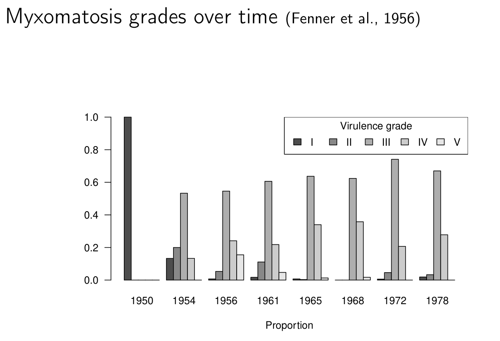

```{r setup, include = FALSE}
library(knitr)
opts_chunk$set(echo=FALSE, fig.width=6, fig.height =4)
```

# Definitions

- **virulence**
   - (broad): decrease in a host's fitness caused by a parasite.  
   - (narrow): *per capita* rate of parasite-induced host mortality
- **resistance**: host's ability to resist or minimize infection
- **tolerance**: host's ability to support parasite infection without losing fitness
- **case mortality** (CM): fraction of hosts killed by infection

- Parasite-host interaction complicates the definition of virulence (assumes that a more virulent parasite is more virulent for *all* host genotypes/species)
- conceptually:
   - parasite load depends on balance between parasite *within-host reproduction rate* and host's *parasite clearance rate*
   - virulence depends on parasite load and per-copy parasite *pathogenicity* and host *tolerance*
   - this establishes the terms of the arms race, but these components can't be separated if we look at a single host-parasite pair (parasite virulence is often confounded with host tolerance)
- all in an arms race rather than RQ context

# Classical dogma

- Parasites evolve lower virulence over time "for the good of the species".  Group-selectionist *but* some evidence?
   - syphilis; first seen in Europe in 1495 (the "Great Pox") [@knell_syphilis_2004]
       - origins? (previously misdiagnosed; evolved increased virulence; from Africa; from the New World)
	   - virulence decreased rapidly over 50 years (maybe even 5-7 years?)
   - *virgin-soil epidemics*: smallpox, etc. [@crosby_virgin_1976; @ostler_disease_2020] (probably *not* virulence: lack of genetic resistance, previous exposure, societal breakdown, effects of colonization?) 
- sampling bias? 
   - biocontrol examples always select for maximal virulence
   - mild introductions may not be noticed

# Tradeoff theory

- Intermediate virulence evolves due to host-level selection (group theory returns); a tradeoff between transmission *rate* (infections/host/time)
and virulence (*defined as mortality/time*) leads to maximum $R_0$
(total transmission per generation) at **intermediate** virulence.
- conceptually, mediated by parasite replication rate or load

## Example: myxomatosis

Viral disease; mild in Brazilian  rabbits (*Sylvilagus brasiliensis*), 
virulent in European rabbits (*Oryctolagus cuniculus*).
Mosquito- and flea-borne. Introduced (several times)
in Australia to control introduced rabbits, finally spread 1950-1951.
Case mortality originally >99\%, populations 
initially decreased by 90%. CM initially dropped to 90\%, then further.
Resistance: test by infecting laboratory rabbits that
haven't evolved. CM of grade III strain drops from
90% to about 50% as populations experience more epizootics.
At the same time mean virus grade drops from I to III, then rebounds.

Evidence for tradeoff theory:
Higher grades (higher case mortality) 
also have faster mortality (<13 days to >50 day
survival as CM goes from >99% to <50%).
Skin virus *titer* is also higher (and increases faster with time) for higher grades. Mosquito infection probability is proportional to skin titer.
(Some biological complications.)



Bottom line: myxomavirus probably still reduces populations
somewhat, but the Australians continue to look for other biocontrol
solutions (calicivirus, rabbit haemhorrhagic disease).

Genomic analysis: @kerrEvolutionary2012a, @kerrComparative2013, @kerrDivergent2022

* Australia
   * some mutations with clear virulence effects (insertion disrupts reading frame involving cell cycle; deletion affects immunosuppressive pathway)
   * **probably** "attenuation-restoration" in Australia: attenuating mutations fixed, then restored
* Britain
   * premature stop codon disrupts immunosuppression
   * parallel evolutions, but different substitutions
   
## Example: HIV

- Correlations among
    - *setpoint viral load*
	- *time to progression* or *rate of CD4 decline* (mechanisms still poorly understood! within-host evolution for diversity, virulence, immune escape? immune aging?? accumulation of opportunistic infections?)
	- *transmission probability* (as measured in *serodiscordant couples*; *Rakai cohort*)
- no longer ethically measurable 

```{r fig.dim = c(6,6), out.width="50%"}

```

<https://www.thebodypro.com/article/course-hiv-disease>


- some suggestion of overall increase in virulence (decreased CD4 count/increased viral load)
- highly variable (e.g. increasing in Italy [@muller_increasing_2009]? attenuating due to spread of less virulent subtype C [@arien_is_2007]? decreasing in Uganda [@blanquart_transmission-virulence_2016]? increasing overall [@herbeck_is_2012]?


## Theory

- if there is a tradeoff, we would expect expect strong effects of **transmission mode**
    - vector-borne > direct
	- high virulence for "necrotransmission" (via dead hosts: anthrax, chronic wasting disease)
	- horizontal transmission > vertical
	- needle-borne > STD?
	- environmental (water-borne, e.g. cholera) > direct
- does higher overall transmission rate (due to population density, poor hygiene, etc.) select for higher transmission?
- **facultative** parasites (e.g. soil-borne microbes with a **facultative** stage) should be more virulent
- "curse of the pharaoh": effect of resting stages? [@bonhoeffer_curse_1996]
- spatial restriction should? decrease virulence [@kamo_evolution_2006]

- Maximizing $R_0$:

```{r r0max, echo= FALSE, fig.height=5, fig.width=6}
c=5; m=1.5; p = 2
ffun = function(x,I) c*x^(1/p)*(1-I)-(m+x)
I = 0.1
par(cex=2,lwd=2,bty="l",yaxs="i",las=1,mgp=c(1,0.5,0),
    mar=c(3,3,1,1))
curve(ffun(x,I=I),from=0,to=10,axes=FALSE,
      ylim=c(0,4),
      xlab="Virulence",ylab="Fitness (w)",n=300)
x1 = 3
y1 = ffun(x1,I=I)
x2 = 4
y2 = ffun(x2,I=I)
segments(c(x1,x2),c(y1,y1),c(x2,x2),c(y1,y2))
arrows(x1,y1-0.15,x2,y1-0.15,angle=15,col=2)
box()
text(6,ffun(6,0.1),pos=4,paste0("frac inf=",0.1),xpd=NA)

I2=0.3
text(6.1,ffun(6,I2),pos=4,paste0("frac inf=",I2),xpd=NA)
I=I2
curve(ffun(x,I=I2),add=TRUE,lty=2)
x1=5
x2=4
y1 = ffun(x1,I=I2)
y2 = ffun(x2,I=I2)
segments(c(x1,x2),c(y1,y1),c(x2,x2),c(y1,y2))
arrows(x1,y1-0.15,x2,y1-0.15,angle=15,col=2)
abline(v=4,col="gray")

## c=3; m=1.5
## curve(c*sqrt(x),from=0,to=10,xlim=c(-3,10),
##       xlab="Virulence",ylab="Transmission")
## tmpfun = function(x) {c/(2*sqrt(x))-c*sqrt(x)/(m+x)}
## u1 = uniroot(tmpfun,lower=0,upper=10)
## abline(a=c*sqrt(m)/2,b=c/(2*sqrt(m)))
## abline(v=m,lty=2)

``` 

- "Virulence" could be effect of host mortality, or rapid clearance.

## Within-host competition

- basic tradeoff theory assumes one infection/strain per host
- effects of mutation, **superinfection**: within-host competition
- tends to *increase* optimal virulence

## Short-sighted evolution

- sometimes evolution is just stupid [@levin_short-sighted_1994]
- meningitis-producing, paralytic polio strains (central nervous system tropism)
- HIV [most transmission probably occurs during acute phases]

## Epidemic vs. endemic phases; transient virulence

- Most theory assumes that disease is at an *endemic equilibrium*, so that *lifetime fitness* (i.e. $R_0$ maximization)  is what matters
    - this also means that increasing overall transmission (due to population density, poor hygiene, etc.) **doesn't** select for higher virulence
- During the exponential growth phase of an epidemic, *speed of increase* ($r$ maximization) is what matters
    - optimal virulence is higher than for endemic equilibrium
- We expect *transient* selection for higher virulence at the beginning of an epidemic

[@frank_models_1996; @bolker_transient_2010; @visher_three_2021; @day_general_2004; @berngruber_evolution_2013; @park_effects_2017]


<!--

```{r fig.dim = c(6,6), out.width="50%"}

```

```{r fig.dim = c(6,6), out.width="50%"}

```

-->


## Effects of vaccines and treatment

- evolution due to **risk compensation** [@massad_impact_2006]?
- evolution of higher virulence in unvaccinated people due to "leaky" vaccination [@gandon_imperfect_2001]?
- mouse malaria: [@mackinnon_immunity_2004; @mackinnon_virulence_2008]; consistent with "arms race" upregulation of replication
- increased virulence in Marek's disease: reduced host generation time or effects of leaky vaccine? [@atkins_vaccination_2013]
- [in HIV due to antiretrovial therapy](herbeck_evolution_2016)?

@mackinnon_virulence_2008:

> a cautionary approach to the widespread use of anti-replication or anti-disease vaccines seems justified. Ideally, this means combining such vaccines with transmission-blocking vaccines, bednets, drugs, housing improvements and other transmission-reducing measures


##  References
 
::: {#refs}
:::

---

Last updated: `r Sys.time()`
	
