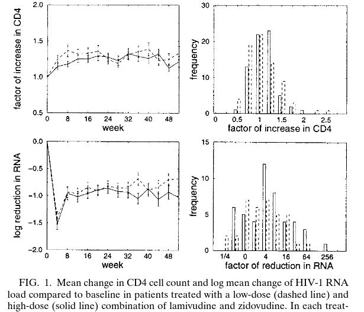
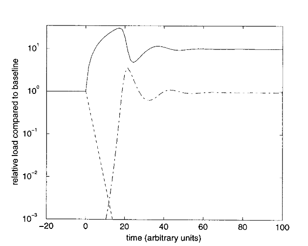
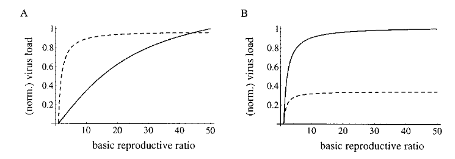
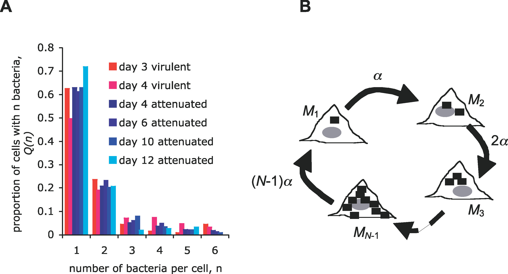
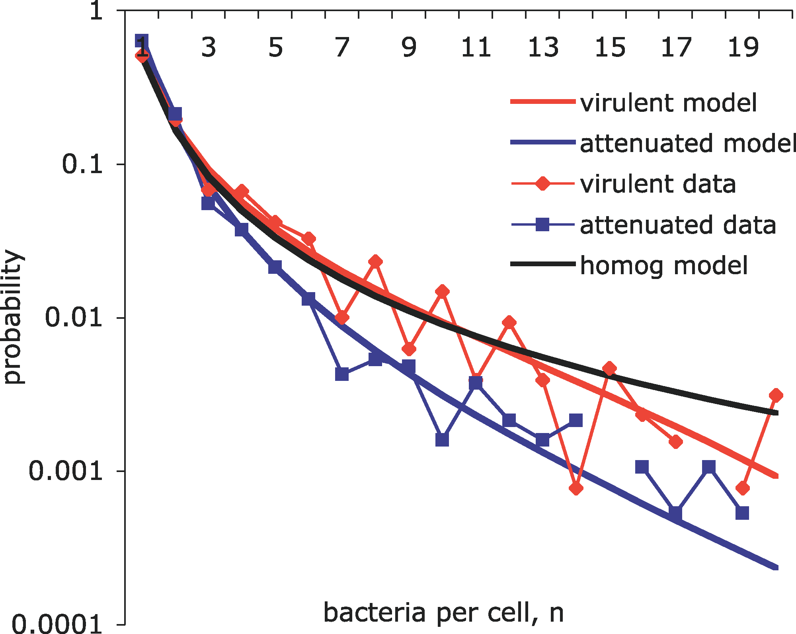
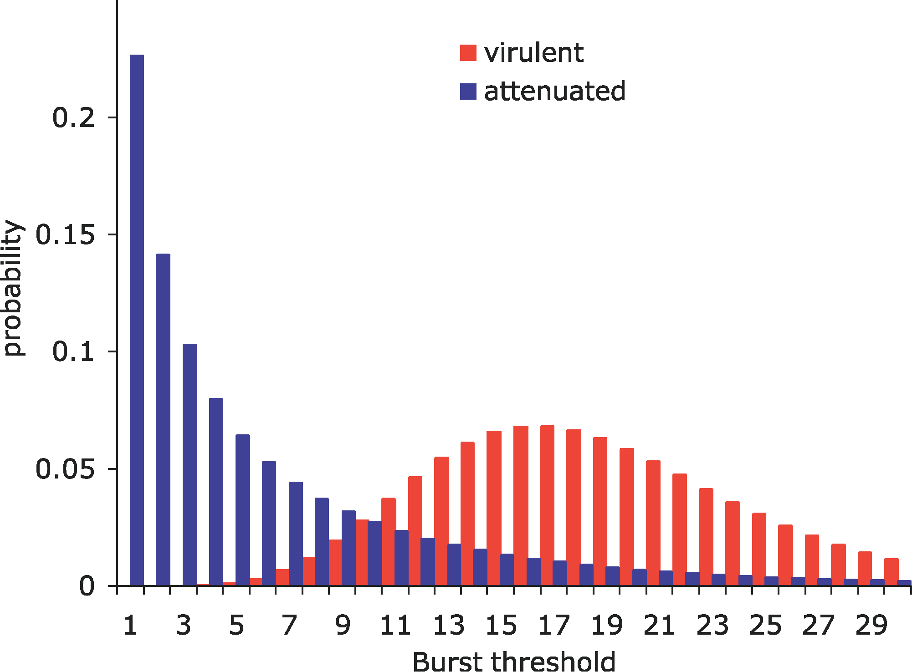

Understanding within-host host-parasite interactions (focus on dynamics)

Lots of molecular biology, genetics (*recognition* mechanisms and *effector* mechanisms), won't deal with that now.

Interaction between different components of the immune system (modeled at different levels of detail/realism), parasite populations (maybe in multiple compartments?)

Longitudinal data (relatively rare), distributional data.

## HIV dynamics under (ineffective) treatment

@bonhoeffer_human_1997

- Early HIV antivirals: relatively ineffective due to rapid mutation
- Large decline in virus loads (up to 300-fold decline in viral RNA in some patients)
- but no clearance
- **within-host** $R_0 \approx 50$ 

- "virus load paradox": if $R_0$ is initially 50, we would have to reduce it to slightly above 1 but never **below** 1 to see these results.

$$
\begin{split}
\frac{dC}{dt} & = \lambda - \mu C - \beta CV \\
\frac{dV}{dt} & = \beta CV - a V
\end{split}
$$

- add a drug-resistant type to the model
- add mutation (and back-mutation) to the model
- add immune responses ($dz/dt = kV - \gamma z$)
- homeostasis of infectible cells (logistic growth)
- virus-induced killing of uninfected cells (e.g. gp120 shedding)
- differential effects of drug on different types
- distribution of infectibility

## Within-host (and within-cell) dynamics of salmonella

- intracellular bacterium

@brown_intracellular_2006

- model:

- assume that host cells are always available (infinite $S$)

- distribution: two categories, or a range of **burst sizes**?

- "constitutive" vs "stochastic" models
- density-dependence in growth and/or burst probability?
- extracellular killing (bactericidal) vs slowing/preventing intracellular growth (bacteriostatic)

> our analysis predicts that the efficacy of common extracellular antibiotics can be enhanced by supplementation with antibiotics slowing intracellular bacterial division [bacteriostatic drugs]. This implies that both bacteriostatic and bactericidal drugs can potentiate the therapeutic efficacy of extracellular antibiotics.

##  References
 
::: {#refs}
:::

---

Last updated: `r Sys.time()`
	
